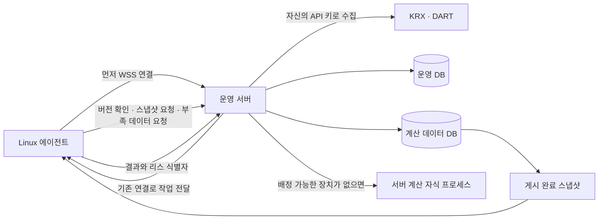

# Linux 계산 에이전트 운영

Linux 또는 WSL2 장치에서 다운로드한 클라이언트가 상주한다. 부모 프로세스가 서버 연결,
데이터 캐시, 자원 측정과 결과 재전송을 담당하고 유니버스·백테스트는 자식 프로세스에서 계산한다.
Docker, 장치 SSH 배포, worker.env, GPU 실행은 사용하지 않는다.

명칭은 다음과 같이 구분한다.

| 명칭 | 책임 | 코드 |
| --- | --- | --- |
| agent | N개의 worker 관리, 서버 연결, 자원·캐시·재전송 관리 | `src/agent/`, 서버 `AgentCoordinator` |
| worker | 동시에 하나의 job 계산 | `src/runtime/workers/backtest-child.ts`, `preparation-child.ts` |
| 임대 관리 | 어느 agent가 작업을 맡았는지와 만료·완료 검증 | `BacktestLeaseService`, `backtest_jobs.agent_id` |

작업 전용 내부 환경 인자는 에이전트가 자식을 만들 때 전달한다. 예를 들어
`WORKER_MAX_BARS`는 자동 측정한 worker당 한도이며 사용자가 작성하는 설정 파일이 아니다.



## 설치와 실행

1. 운영 웹의 **설정 → Agent**에서 Agent 이름을 입력하고 전용 토큰을 발급한다.
   토큰은 발급 직후 한 번만 표시한다. Agent마다 별도로 발급한다.
2. 같은 화면에서 해당 Linux 아키텍처의 압축 파일을 다운로드한다.
3. 다운로드한 파일이 있는 디렉터리에서 일반 사용자로 다음 명령을 실행한다. 아래는 x64 기준이다.

   ```bash
   mkdir -p quant-agent
   tar -xzf quant-agent-linux-x64.tar.gz -C quant-agent
   cd quant-agent
   ./quant-agent install
   ```

   arm64 패키지는 압축 파일명을 `quant-agent-linux-arm64.tar.gz`로 바꾼다.
   서버 HTTPS 주소와 Agent 토큰을 입력하면 사용자 systemd 서비스가 시작된다.
   토큰은 입력하거나 붙여 넣은 원문 그대로 터미널에 표시된다.

Node 런타임과 필요한 패키지를 클라이언트에 포함하므로 장치에 Node·pnpm을 설치하지 않는다.
Linux glibc 환경과 tar, 사용자 systemd가 필요하다. `dist/clients/manifest.json`에 빌드 환경의
최소 glibc 버전을 기록한다. 배포 아키텍처는 실제 빌드한 x64 또는 arm64이며 다른 아키텍처는
동일 Git 커밋을 해당 Linux 환경에서 빌드해야 한다.

```bash
systemctl --user status quant-agent
journalctl --user -u quant-agent -f
systemctl --user restart quant-agent
systemctl --user disable --now quant-agent
```

설치기는 로그아웃 후에도 계속 실행되도록 사용자 linger 활성화를 시도한다.
완료하지 못했다는 안내가 나오면 환경의 권한 정책에 따라 관리자가 다음 명령을 실행한다.

```bash
loginctl enable-linger "$USER"
```

WSL2는 Linux의 systemd를 활성화해야 한다. Windows 절전·종료나 WSL 종료 동안에는
작업할 수 없다. systemd 없이 직접 실행할 때는 `./quant-agent setup` 후
`./quant-agent run`을 사용하며 자동 업데이트 후 종료 코드 75가 나면 실행 관리자가 재시작해야 한다.

기존 SHA 기반 agent는 제거한 뒤 새 패키지로 다시 설치한다. 구형 작업 상태와 데이터 캐시는 재사용하지 않는다.

## 클라이언트 명령어

아래 명령은 패키지 압축을 푼 디렉터리에서 일반 사용자로 실행한다.

| 명령어 | 동작 |
| --- | --- |
| `./quant-agent` | 명령을 생략하면 `install`을 실행한다. |
| `./quant-agent install` | 클라이언트를 사용자 경로에 설치하고 systemd 서비스를 등록·활성화한다. 설정 파일이 없을 때만 서버 주소와 토큰을 입력받으며, 기존 설정은 그대로 사용한다. |
| `./quant-agent setup` | 서버 주소와 토큰을 입력받아 설정 파일을 생성하거나 덮어쓴다. 서비스 설치나 재시작은 수행하지 않는다. |
| `./quant-agent run` | 현재 터미널에서 Agent를 실행한다. 설정 파일이 없으면 먼저 서버 주소와 토큰을 입력받는다. `Ctrl+C`로 종료한다. |
| `./quant-agent update` | 저장된 서버 주소와 토큰으로 게시된 최신 클라이언트를 확인하고 다운로드·검증 후 설치한다. 실행 중인 사용자 systemd 서비스는 재시작한다. 이미 최신이면 다운로드와 재시작을 생략한다. |
| `./quant-agent --check` | 클라이언트 내용 버전·빌드 커밋·Linux 아키텍처를 출력하고 종료한다. 서버에 연결하거나 설정을 변경하지 않는다. |

`install`, `setup`, `run`, `update` 뒤에 `--state 경로`를 붙이면 설정·데이터 캐시·작업 상태를 저장할
디렉터리를 지정할 수 있다. 예: `./quant-agent setup --state /home/사용자/agent-state`.
`install --state 경로`로 설치한 서비스는 해당 경로를 사용하므로, 이후 `setup`, `run`, `update`에도
같은 경로를 지정한다. 서버 주소와 토큰을 입력하는 모든 명령에서 토큰 원문이 표시된다.

설치 후 기본 설치 경로의 클라이언트로 서버 주소나 토큰을 변경하려면 다음과 같이 실행한다.
`setup`은 실행 중인 서비스에 설정을 즉시 반영하지 않으므로 저장 후 서비스를 재시작한다.

```bash
~/.local/share/quant-agent/current/quant-agent setup
systemctl --user restart quant-agent
```

`XDG_DATA_HOME`을 지정해 설치했다면 실행 파일은 해당 경로 아래 `quant-agent/current/quant-agent`에 있다.
별도 `--state` 경로를 사용했다면 위 `setup` 명령에도 같은 옵션을 붙인다.
서비스 상태 확인·재시작·중지는 앞서 안내한 `systemctl --user` 명령으로 수행한다.

## 설정과 자원 관리

기본 경로는 다음과 같다. XDG 경로와 `--state 경로`로 상태 위치를 바꿀 수 있다.

| 용도 | 경로 |
| --- | --- |
| 서버 주소·장치 토큰 | `~/.local/state/quant-agent/settings.json` (600) |
| 로컬 입력 스냅샷 | `~/.local/state/quant-agent/datasets/` |
| 작업과 전송 대기 결과 | `~/.local/state/quant-agent/jobs/` |
| 설치 버전 | `~/.local/share/quant-agent/releases/` |
| 현재 실행 버전 | `~/.local/share/quant-agent/current` |
| 서비스 | `~/.config/systemd/user/quant-agent.service` |

설정값은 `serverUrl`, `token` 두 가지다. CPU 수·메모리 용량·동시성 설정은 없다.
CPU affinity, cgroup 제한, 사용 가능한 메모리와 시스템 부하를 측정하고 작업 RSS를 관찰한다.
시스템 여유분을 남긴 뒤 슬롯 수, 자식 V8 heap, 적재 봉 수 한도를 자동 산정한다.
장치가 보고한 한도보다 큰 작업은 그 장치에 배정하지 않는다. 큰 대기 작업이 있으면
병렬도를 줄여 작업당 메모리 예산을 늘린다. 서버에도 제출 시 봉 수 검사를 유지하며
제출 한도는 최소 기존 200만 봉 기준을 유지하고 연결 장치·서버의 더 큰 수용량을 반영한다.
실제 실행 배정은 각 실행기의 현재 가용 자원 한도 안에서만 한다. 실행 도중 메모리 부족으로
프로세스가 종료되면 해당 작업의 실패로 기록한다.

## 수동 업데이트

최초 설정에서 저장한 토큰으로 서버의 클라이언트 명세와 패키지를 받을 수 있다.
WSS 연결 이력이 없어도 발급된 토큰이 유효하면 다운로드할 수 있으며, 웹에서 장치를
해제하면 다운로드 권한도 사라진다. 웹 로그인이나 새 토큰 발급은 필요 없다.

```bash
~/.local/share/quant-agent/current/quant-agent update
# 별도 상태 디렉터리로 설치한 경우 같은 경로를 지정한다.
~/.local/share/quant-agent/current/quant-agent update --state /home/사용자/agent-state
```

`XDG_DATA_HOME`을 사용했다면 해당 설치 경로의 `current/quant-agent`를 실행한다.
압축 해제 폴더의 `./quant-agent update`를 실행해도 현재 설치된 내용 버전을 기준으로
최신 여부를 확인한다.

- 패키지 크기·SHA-256·내부 버전·실행 검사를 통과한 뒤 `current` 링크를 교체한다.
- 다운로드나 검증이 실패하면 현재 설치와 서비스는 유지한다. 직전 릴리스도 보관한다.
- 설치·자동 업데이트·수동 업데이트는 공통 잠금으로 중복 실행을 막는다.
- 실행 중인 사용자 systemd 서비스는 재시작한다. 중지된 서비스는 시작하지 않는다.
- 직접 `run`으로 실행 중이면 종료한 뒤 업데이트하고, 안내된 `current/quant-agent run`으로
  다시 실행한다. 상태 디렉터리를 지정했다면 재실행 때도 같은 `--state`를 사용한다.
- 서비스 재시작만 실패하면 새 설치는 보존하고 `systemctl --user restart quant-agent`를 안내한다.

최신 여부는 게시 명세와 설치 패키지의 `agentVersion`을 비교한다. 운영 배포의 Git SHA와
게시 시각은 출처 정보이며, 웹·인증 코드만 바뀌어 재게시된 패키지는 다시 설치하지 않는다.
미리보기·수집·백테스트·기간 검증도 별도 내용 버전을 갖는다. 자세한 입력 범위와 설치
계약은 [Agent 실행 경계와 도메인 버전](AGENT_RUNTIME_BOUNDARY.md)에 정리한다.

## 작업 배정과 로컬 실행

새 작업은 필요한 데이터 버전과 자원을 갖춘 유휴 에이전트에 먼저 배정한다. 배정할
에이전트가 없으면 타임아웃을 기다리지 않고 운영 서버의 계산 자식 프로세스를 사용한다.
원격 장치와 운영 서버 모두 여유가 없을 때만 큐에 대기한다. 이미 모든 슬롯을 사용하는
에이전트도 새 작업을 받을 수 없으므로 같은 로컬 실행 기준을 적용한다.

큐 등록, 에이전트 연결 후 준비 완료, 슬롯 통지, 작업 완료와 데이터 대기 해제 이벤트가
배정을 즉시 깨운다. 2초 주기 점검은 복구용 보조 경로다. 대기 작업을 배정할 때마다
원격 장치를 먼저 확인하며, 연결이 끊긴 장치의 유효한 리스를 로컬에서 중복 실행하지 않는다.
나중에 에이전트가 연결돼도 이미 시작한 로컬 계산은 완료까지 유지한다.

서버 내부 실행기는 같은 에이전트의 계산·리스·결과 검증 코드를 사용한다. 내부 메시지와
게시된 읽기 전용 스냅샷을 직접 사용하므로 서버 자신에게 WSS를 연결하거나 DB 파일을
다시 다운로드하지 않는다. 별도 설치, 장치 토큰 또는 worker.env 설정은 필요 없다.
작업 상태와 전송 대기 결과는 계산 DB 옆 `server-agent/`에 보존한다.

서버에서는 최소 256 MiB 또는 전체 메모리의 25%를 여유분으로 남기고 CPU도 자동으로
여유분을 확보한다. 메모리·CPU가 부족하면 신규 계산을 시작하지 않는다. 두 실행 경로는
동일한 원자적 큐 선점과 리스 검증을 사용한다. 정상 종료는 서버 자식 종료를 확인한 뒤
로컬 리스를 반환하며, 비정상 종료 후 남은 리스는 만료 절차를 따른다.

## 연결 중단과 재시도

WSS는 TLS 위의 WebSocket 연결이다. PC에서 운영 서버의 HTTPS 포트로 연결하므로 PC의
인바운드 포트를 열지 않는다. 서버는 연결로 작업을 보내며 파일은 인증된 HTTPS로 전송한다.

- 재접속: 지수 백오프와 무작위 지연, 약 1~30초.
- 작업 리스: 90초, heartbeat 15초. 일시 단절 후 유효한 리스는 계속 사용할 수 있다.
- 리스 만료: 클라이언트는 계산을 취소하고 서버는 다시 배정한다. 계산 연결 실패 3회면 실패한다.
- 식별자: 장치·작업·attempt·새 난수 lease token을 대조한다. 이전 시도의 늦은 결과는 거부한다.
- 결과 응답 유실: 디스크 outbox에서 재전송한다. 같은 완료 결과는 중복 저장하지 않는다.
- 사용자 취소: 연결로 전달하고 자식 IPC → 2초 뒤 SIGTERM → 5초 뒤 SIGKILL 순서로 종료한다.
- 서버가 요구하는 `agentVersion` 변경: 이전 리스를 폐기하고 작업을 재배정한다. 클라이언트는 계산·업로드를
  정리한 뒤 새 파일의 해시와 실행 검사를 통과해야 현재 버전을 교체한다. 업데이트는 계산 실패로 세지 않는다.

웹에서 장치를 해제하면 토큰과 연결이 더 이상 작업·데이터에 접근하지 못한다. 이미 장치에
다운로드한 계산 데이터 파일을 원격으로 회수하는 기능은 없다.

## 데이터 버전과 부족 데이터 처리

운영 서버의 `app.sqlite`에는 계정, 세션, API 사용량, 수집 큐, 작업·결과를 저장한다.
`app.data.sqlite`에는 가격, 종목 이력·구성, 재무·자본변동 facts, 벤치마크와 각 데이터의
커버리지만 저장한다. 정확한 테이블 경계는 `database-tables.ts`와 각 Drizzle 스키마가 정의한다.
원본 API 응답 캐시와 인증 정보는 배포하지 않는다. 장치는 운영 DB나 공급자 API에 직접 접근하지 않는다.

계산 DB의 변경 revision과 **게시 버전**을 구분한다. 서버는 별도 프로세스로 SQLite backup을
생성하고 테이블 경계·무결성·해시를 확인한 뒤 latest 명세를 원자적으로 교체한다. 복원으로
원본 revision이 낮아져도 게시 버전은 증가한다. 매 작업 배정 전에 최신 게시 버전을 확인한다.
동일 파일은 재다운로드하지 않으며 새 파일을 검증한 뒤 캐시를 교체한다. 실행 중 작업은
시작할 때의 스냅샷을 유지한다. 서버는 현재·직전·실행 리스가 참조하는 스냅샷을 보존한다.

유니버스 계산 중 부족한 날짜·등록 종목·재무 연도 등을 만나면 클라이언트가 수집 요구를
보낸다. 서버는 동일 요구를 합쳐 영속 큐에 넣고 자신의 API 키와 quota 정책으로 수집한다.
해당 작업은 `WAITING_DATA`로 전환하고 계산 슬롯을 반환한다. 다른 준비된 작업을 실행할 수 있다.
수집 완료와 새 스냅샷 게시 이후 대기 작업을 재개한다. 데이터 대기는 계산 실패 횟수를
소모하지 않으며, quota 소진은 다음 허용 시각까지 대기한다. 공급자 응답으로도 결손이
계속 남으면 무한 재수집하지 않고 오류를 기록한다.

## DB 마이그레이션과 복원

`DATABASE_PATH`는 운영 파일이며 계산 파일 경로는 자동으로 `*.data.sqlite`로 결정한다.
각 파일은 `migrations/operations`, `migrations/data`의 독립 마이그레이션 이력을 가진다.
배포는 서비스를 중지하고 두 DB를 백업한 뒤 새 릴리스의 `db:prepare`를 실행한다.
`db:prepare`는 systemd oneshot 작업으로 실행하여 중단 신호를 배포 실패로 처리한다.
SSH 연결 유지 패킷과 응답 제한으로 긴 검증 중 연결 단절도 감지한다.

```bash
# 운영 서버에서는 서비스 중지 및 app.env를 읽는 systemd-run 절차를 먼저 적용한다.
pnpm cli db:backup /안전한경로/before.sqlite
pnpm cli db:prepare
# 복원이 필요하면 서비스를 멈춘 상태에서 실행한다.
pnpm cli db:restore /안전한경로/before.sqlite
```

백업 세트는 `before.sqlite`, `before.sqlite.data`, `before.sqlite.json` 세 파일이다.
복원은 모든 해시를 먼저 확인하고 임시 파일과 복원 기록으로 진행한다. 중단되면 같은
`db:restore`를 다시 실행한다. 복원 기록이 남았거나 연결된 파일이 없거나 데이터셋 식별자가
다르면 앱은 부팅하지 않는다. SQLite WAL의 여러 파일 쓰기를 하나의 원자적 트랜잭션으로
간주하지 않으며, 유지보수 중 모든 쓰기를 중지한다.

일회성 단일 DB 분리 코드는 전환 릴리스 `040ef56`에 남아 있다. 현재 릴리스는 이미 분리된
DB 또는 새 DB만 지원한다. 분리 전 백업을 복원해야 한다면 해당 전환 릴리스의 CLI로
복원·분리를 먼저 완료한다. 분리 당시 보존한 원본 백업과 해당 릴리스를 함께 보관한다.

데이터 마이그레이션 `0001_retire_completed_conversions`는 완료된 SCD 변환의 임시 테이블과
사용하지 않는 `symbol_facts_state.updated_at_ms`를 삭제한다. 미변환 체크포인트·이벤트나
PENDING 상태의 종목 이력이 있으면 삭제하지 않고 중단한다. 현재 종목 버전, 재무·자본변동의
독립 watermark는 보존한다. 이후 `0002_collection_coverage_version`은 KRX coverage의 수집
실행 출처 컬럼을 추가한다. NULL·이전 값도 재사용하며 현재 해시로 덮어쓰지 않는다.
새 데이터 마이그레이션은 확인된 입력 문제와 관련 revision 처리를 추가하고 새 스냅샷을 게시한다.
에이전트의 실행·스키마 계약이 바뀌면 새 `agentVersion`의 클라이언트로 업데이트한다.
수집 파서·서버 버전 변경만으로 정상 DB를 재해석하거나 재수집하지 않는다. 실제 결손·손상이
확인된 요청 범위에서만 저장 원문 재사용과 필요한 외부 수집을 수행한다.

## 빌드와 배포

```bash
pnpm build:agent       # 현재 Linux 아키텍처의 독립 실행 패키지
pnpm test:agent-package # 압축 파일로 준비·백테스트 실제 실행
pnpm run deploy        # 서버 SSH 배포 + 같은 Git 버전 클라이언트 파일 게시
```

`deploy.env`에는 `HOST`·`SSH_*` 접속 설정만 있다. 공급자 API 키와 서비스 설정은 서버의
`app.env`에 남는다. 옛 worker 환경변수, Docker image·Compose, worker bootstrap·deploy 경로는
제거했다. 장치에 SSH하거나 장치별 runtime env를 배포하지 않는다. 클라이언트 파일은 앱
릴리스와 함께 교체되며 실패 시 코드와 DB 백업 세트를 함께 복원한다.


## 기존 명칭의 DB 이행

운영 마이그레이션 `0004_agent_ownership`은 `backtest_jobs.worker_id`를 `agent_id`로
이름 변경하고 값의 `remote:` 접두사를 한 번 제거한다. 상태·attempt·임대 token hash·만료
시각·완료 결과는 보존한다. 새 DB 생성에도 필요한 운영 스키마 이행 순서를 유지한다.
과거 마이그레이션과 결정 이력의 이름은
당시 스키마를 설명하므로 유지한다. 과거 비밀 키 이름의 로그 마스킹도 유지한다.


## 공급자 원문·최신성·자동 수집 운영 (D-096·D-099)

원문과 공시 조회 checkpoint·요청 계획·HTTP 시도 원장은 서버 운영 DB에 보관한다.
계산 DB와 함께 백업·복원하며, 원문·coverage를 지워 재수집을 유도하지 않는다. 정상
legacy 자료는 원문이 없어도 현재 계산에 충분하면 재사용한다. 필요한 원문·필드가 없거나
손상·정정이 확인되면 요청 키와 근거 fingerprint 범위만 자동 수집한다(D-099).
별도 외부 데이터 카드·수집 현황·승인 버튼은 제공하지 않고 기존 작업 진행률만 사용한다.
물리 시도 이력은 보존한다. 연결 실패·HTTP 5xx는 5회 전까지 지수 지연으로 자동 재시도하고, 5회 한도에 이르면 15분 뒤 다음 5회를 자동 예약한다.

DART 목록은 미리보기 시작마다 `list.json` 최대 2회, 총 5초만 확인한다(D-098).
서버 시작만으로 새 조회를 만들지 않으며 `DART_DISCOVERY_HOUR_KST` 설정은 없다.
동시 미리보기는 진행 중인 짧은 목록 확인을 공유한다. 이전 완료 경계를 하루 겹쳐 조회하되
최대 최근 80일로 제한하고 그 이전 공백은 별도 수집 이력으로 남긴다. 확인 이력이 없으면
어제부터 시작하며 전체 과거 공시를 확인했다고 표시하지 않는다.
미리보기는 즉시 준비 작업으로 접수하고 목록 확인 종료 후 계산에 배정한다. 실패·시간 초과·
미확인 페이지가 있어도 기존 DB로 진행한다. 완료 결과 읽기는 새 조회를 시작하지 않는다.

미리보기의 짧은 확인이 끝나면 남은 목록을 내부에서 자동으로 처리한다. 1회 작업은 최대
100회·30초로 제한하며 잔여 checkpoint나 오류가 있으면 15분 뒤 이어서 처리한다. 같은 날의 내부 작업과 이미 닫힌 기간은
저장된 커서부터 이어 읽는다. 당시 열린 기간은 날짜가 바뀌면 첫 페이지부터 다시 읽어
추가 접수를 확인하며, 새 미리보기는 항상 최근 구간의 첫 페이지부터 확인한다. 이 수집이 실행 중이어도 새 미리보기는 대기하지 않는다.

최신성 확인은 이번 페이지의 종목·연도·보고서에 대한 작은 메타데이터 조회만 한다.
저장 원문과 기업코드 XML을 읽거나 모든 연도를 해시·파싱하는 단계는 없다. 기존 원문의
새 접수번호 컬럼은 NULL로 유지하며 채우기 위한 전수 재생을 하지 않는다. 반영 여부를
입증할 수 없는 legacy 자료는 미확인 경고와 함께 재사용한다. 확인된 새 공시·입력 결손은
별도 데이터 수집 단계에서 해당 범위만 처리한다. API 반영 대기는 범위별 예약 재시도로,
손상·정정 본문 교체는 D-099의 자동 수집 정책으로 처리한다.

확인 시각·범위·요청 근거는 내부 기록으로만 관리한다.
목록 장애나 확인 이력 없음만으로 기존 검증 데이터의 실행을 막지 않는다. 확인된 손상·정정과
필수 입력 결손은 복구 완료 전까지 해당 범위를 차단한다. 정체성 불일치·해석 불가 공시는 자동 처리하지 않는다. 실행 당시의 최신성 상태는
`provider_execution_provenance`에 고정한다. 자동 복구가 끝난 데이터는 새 revision·스냅샷으로
전달하고 이미 완료된 결과의 입력을 사후 교체하지 않는다.

KRX는 [공식 거래일력](krx-trading-calendar.md)으로 휴장과 게시 전 빈 응답을 구분한다.
구현의 검증 결과와 한계는 [검증 기록](provider-data-reuse-verification.md)을 확인한다. 운영 DB나 실 공급자 API로
자동 smoke를 실행해 검증을 대신하지 않는다.
