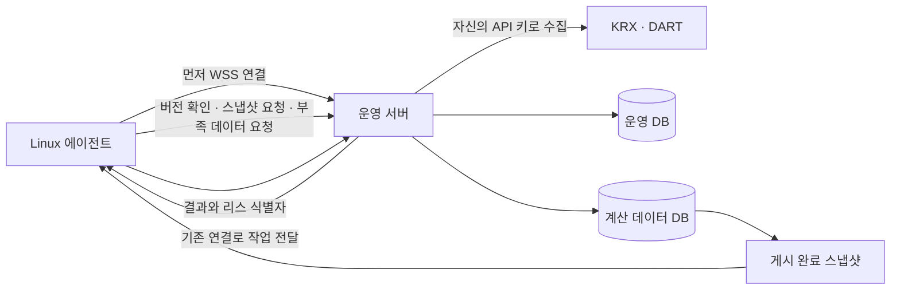

# Linux 계산 에이전트 운영

Linux 또는 WSL2 장치에서 다운로드한 클라이언트가 상주한다. 부모 프로세스가 서버 연결,
데이터 캐시, 자원 측정과 결과 재전송을 담당하고 유니버스·백테스트는 자식 프로세스에서 계산한다.
Docker, 장치 SSH 배포, worker.env, GPU 실행은 사용하지 않는다.



## 설치와 실행

1. 운영 웹의 **설정 → 계산 장치**에서 장치 이름을 입력하고 전용 토큰을 발급한다.
   토큰은 발급 직후 한 번만 표시한다. 장치마다 별도로 발급한다.
2. 같은 화면에서 해당 Linux 아키텍처의 압축 파일을 다운로드하고 푼다.
3. 일반 사용자로 압축을 푼 디렉터리에서 `./quant-agent install`을 실행한다.
   서버 HTTPS 주소와 장치 토큰을 입력하면 사용자 systemd 서비스가 시작된다.

Node 런타임과 필요한 패키지를 클라이언트에 포함하므로 장치에 Node·pnpm을 설치하지 않는다.
Linux glibc 환경과 tar, 사용자 systemd가 필요하다. `dist/clients/manifest.json`에 빌드 환경의
최소 glibc 버전을 기록한다. 배포 아키텍처는 실제 빌드한 x64 또는 arm64이며 다른 아키텍처는
동일 Git 커밋을 해당 Linux 환경에서 빌드해야 한다.

```bash
systemctl --user status quant-agent
journalctl --user -u quant-agent -f
systemctl --user restart quant-agent
systemctl --user disable --now quant-agent
```

설치기는 로그아웃 후에도 계속 실행되도록 사용자 linger 활성화를 시도한다.
완료하지 못했다는 안내가 나오면 환경의 권한 정책에 따라 관리자가 다음 명령을 실행한다.

```bash
loginctl enable-linger "$USER"
```

WSL2는 Linux의 systemd를 활성화해야 한다. Windows 절전·종료나 WSL 종료 동안에는
작업할 수 없다. systemd 없이 직접 실행할 때는 `./quant-agent setup` 후
`./quant-agent run`을 사용하며 자동 업데이트 후 종료 코드 75가 나면 실행 관리자가 재시작해야 한다.

기본 경로는 다음과 같다. XDG 경로와 `--state 경로`로 상태 위치를 바꿀 수 있다.

| 용도 | 경로 |
| --- | --- |
| 서버 주소·장치 토큰 | `~/.local/state/quant-agent/settings.json` (600) |
| 로컬 입력 스냅샷 | `~/.local/state/quant-agent/datasets/` |
| 작업과 전송 대기 결과 | `~/.local/state/quant-agent/jobs/` |
| 설치 버전 | `~/.local/share/quant-agent/releases/` |
| 현재 실행 버전 | `~/.local/share/quant-agent/current` |
| 서비스 | `~/.config/systemd/user/quant-agent.service` |

설정값은 `serverUrl`, `token` 두 가지다. CPU 수·메모리 용량·동시성 설정은 없다.
CPU affinity, cgroup 제한, 사용 가능한 메모리와 시스템 부하를 측정하고 작업 RSS를 관찰한다.
시스템 여유분을 남긴 뒤 슬롯 수, 자식 V8 heap, 적재 봉 수 한도를 자동 산정한다.
장치가 보고한 한도보다 큰 작업은 그 장치에 배정하지 않는다. 큰 대기 작업이 있으면
병렬도를 줄여 작업당 메모리 예산을 늘린다. 서버에도 제출 시 봉 수 검사를 유지하며
연결된 장치가 없을 때는 기존 200만 봉 기준을 적용한다. 실행 도중 메모리 부족으로
프로세스가 종료되면 해당 작업의 실패로 기록한다.

## 연결 중단과 재시도

WSS는 TLS 위의 WebSocket 연결이다. PC에서 운영 서버의 HTTPS 포트로 연결하므로 PC의
인바운드 포트를 열지 않는다. 서버는 연결로 작업을 보내며 파일은 인증된 HTTPS로 전송한다.

- 재접속: 지수 백오프와 무작위 지연, 약 1~30초.
- 작업 리스: 90초, heartbeat 15초. 일시 단절 후 유효한 리스는 계속 사용할 수 있다.
- 리스 만료: 클라이언트는 계산을 취소하고 서버는 다시 배정한다. 계산 연결 실패 3회면 실패한다.
- 식별자: 장치·작업·attempt·새 난수 lease token을 대조한다. 이전 시도의 늦은 결과는 거부한다.
- 결과 응답 유실: 디스크 outbox에서 재전송한다. 같은 완료 결과는 중복 저장하지 않는다.
- 사용자 취소: 연결로 전달하고 자식 IPC → 2초 뒤 SIGTERM → 5초 뒤 SIGKILL 순서로 종료한다.
- 서버 실행 버전 변경: 이전 리스를 폐기하고 작업을 재배정한다. 클라이언트는 계산·업로드를
  정리한 뒤 새 파일의 해시와 실행 검사를 통과해야 현재 버전을 교체한다. 업데이트는 계산 실패로 세지 않는다.

웹에서 장치를 해제하면 토큰과 연결이 더 이상 작업·데이터에 접근하지 못한다. 이미 장치에
다운로드한 계산 데이터 파일을 원격으로 회수하는 기능은 없다.

## 데이터 버전과 부족 데이터 처리

운영 서버의 `app.sqlite`에는 계정, 세션, API 사용량, 수집 큐, 작업·결과를 저장한다.
`app.data.sqlite`에는 가격, 종목 이력·구성, 재무·자본변동 facts, 벤치마크와 각 데이터의
커버리지만 저장한다. 정확한 테이블 경계는 `database-tables.ts`와 각 Drizzle 스키마가 정의한다.
원본 API 응답 캐시와 인증 정보는 배포하지 않는다. 장치는 운영 DB나 공급자 API에 직접 접근하지 않는다.

계산 DB의 변경 revision과 **게시 버전**을 구분한다. 서버는 별도 프로세스로 SQLite backup을
생성하고 테이블 경계·무결성·해시를 확인한 뒤 latest 명세를 원자적으로 교체한다. 복원으로
원본 revision이 낮아져도 게시 버전은 증가한다. 매 작업 배정 전에 최신 게시 버전을 확인한다.
동일 파일은 재다운로드하지 않으며 새 파일을 검증한 뒤 캐시를 교체한다. 실행 중 작업은
시작할 때의 스냅샷을 유지한다. 서버는 현재·직전·실행 리스가 참조하는 스냅샷을 보존한다.

유니버스 계산 중 부족한 날짜·등록 종목·재무 연도 등을 만나면 클라이언트가 수집 요구를
보낸다. 서버는 동일 요구를 합쳐 영속 큐에 넣고 자신의 API 키와 quota 정책으로 수집한다.
해당 작업은 `WAITING_DATA`로 전환하고 계산 슬롯을 반환한다. 다른 준비된 작업을 실행할 수 있다.
수집 완료와 새 스냅샷 게시 이후 대기 작업을 재개한다. 데이터 대기는 계산 실패 횟수를
소모하지 않으며, quota 소진은 다음 허용 시각까지 대기한다. 공급자 응답으로도 결손이
계속 남으면 무한 재수집하지 않고 오류를 기록한다.

## DB 마이그레이션과 복원

기존 단일 DB에서의 분리는 앱 쓰기를 멈춘 유지보수 구간에서 실행한다. 배포 스크립트는
서비스를 먼저 중지하고 새 릴리스 CLI로 백업한 뒤 `db:prepare`를 실행한다.

```bash
# 운영 서버에서는 서비스 중지 및 app.env를 읽는 기존 systemd-run 절차를 먼저 적용한다.
pnpm cli db:backup /안전한경로/before.sqlite
pnpm cli db:prepare
# 복원이 필요하면 서비스를 멈춘 상태에서:
pnpm cli db:restore /안전한경로/before.sqlite
```

`DATABASE_PATH`가 운영 파일이며 계산 파일 경로는 자동으로 `*.data.sqlite`로 결정한다.
각 파일은 `migrations/operations`, `migrations/data`의 독립 마이그레이션 이력을 가진다.
원래 단일 DB migration 파일은 이전 DB 검증용으로 보존한다.

분리 시 기존 데이터를 새 두 파일로 복사하고 행·참조·무결성·autoincrement를 검증한다.
기존 파일은 `app.sqlite.split-<UUID>.backup.sqlite`로 남긴다. 도중 중단되면
`app.sqlite.split-migration.json`을 기준으로 같은 `db:prepare` 명령이 복구를 이어간다.
앱은 분리·복원 journal이 남아 있거나 서로 다른 데이터셋의 파일이면 부팅하지 않는다.

백업 세트는 `before.sqlite`, `before.sqlite.data`(분리 DB일 때), `before.sqlite.json`이다.
세 파일을 함께 보존한다. 복원은 모든 해시를 먼저 확인하고 staged 파일과 복원 journal로
진행한다. 중단되면 같은 `db:restore`를 다시 실행한다. 기존 단일 DB 백업을 복원하면
분리 전 형식으로 돌아간다. SQLite WAL의 여러 파일 쓰기를 하나의 crash-atomic 트랜잭션으로
간주하지 않는다. 유지보수 중 모든 쓰기 중지와 게시·복원 journal이 복구 경계다.

## 빌드와 배포

```bash
pnpm build:agent       # 현재 Linux 아키텍처의 독립 실행 패키지
pnpm run deploy        # 앱 SSH 배포 + 같은 Git 버전 클라이언트 파일 게시
```

`deploy.env`에는 `QP_APP_*` 접속 설정만 있다. 공급자 API 키와 서비스 설정은 서버의
`app.env`에 남는다. 옛 worker 환경변수, Docker image·Compose, worker bootstrap·deploy 경로는
제거했다. 장치에 SSH하거나 장치별 runtime env를 배포하지 않는다. 클라이언트 파일은 앱
릴리스와 함께 교체되며 실패 시 코드와 DB 백업 세트를 함께 복원한다.
