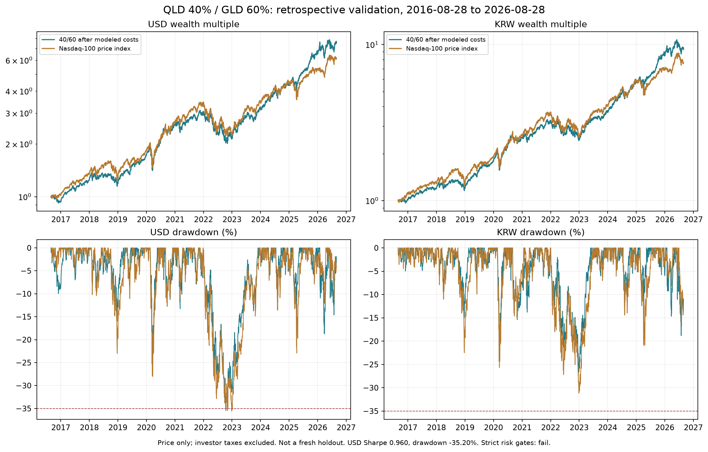

# 신뢰도 우선 전략 연구: 남길 후보는 QLD 40%·GLD 60%

2026-09-06 기준. [1차 연구](reliable-ten-year-strategy-report.md)와
[추가 연구 사전 기록](diversified-risk-protocol.md)을 합쳐 개발 조합 36개를 검토했다.
남길 연구 후보 하나는 **QLD 40%·GLD 60%, 월간 재조정**이다. 복잡한 예측 모델이나
최적 비중을 사용하지 않는다. 최근 10년 수익 목표와 체결·난수 안정성은 확인했다.

**엄격 위험 관문은 통과하지 못했다.** 미리 정한 달러 초과 샤프 1.0 이상,
최대 낙폭 35% 이내에 대해 실제 값은 0.9600, -35.1991%다. 원화에서는 두 기준을
넘지만, 이를 이유로 달러 실패를 없애지 않는다. 여러 과거 10년을 모두 이기지도
못했다. 따라서 이 문서의 선택은 가장 유력한 **연구 후보의 선택**이며, ‘신뢰도가
충분히 입증된 최종 전략’이나 목표의 완전한 달성으로 표시하지 않는다.

## 고정한 매매 규칙

- 자산은 실제 상장 ETF QLD와 GLD 두 개다. QLD는 나스닥100 **일일 2배** 목표 ETF다.
  장기 나스닥 수익률의 2배를 가정하지 않고 실제 시장 가격을 사용했다.
  [QLD 운용사 설명](https://www.proshares.com/our-etfs/leveraged-and-inverse/qld)
- 월말 미국 거래일 종가로 전체 달러 평가액을 계산한다. 1% 현금 여유를 반영한
  목표는 **QLD 39.6%, GLD 59.4%, 현금 1%**다.
- 각 목표 금액을 그날 실제 단위 종가로 나눈 뒤 내림하여 정수 목표 수량을 정한다.
  다음 거래일 시가에 매도한 뒤 매수한다. 매매 사이에 비중은 시장에 따라 움직인다.
- 계좌 차입과 공매도는 없다. 현금이 부족하면 매수 수량을 줄인다. 거래량 제한을
  적용하며 미체결을 사후 좋은 가격으로 바꾸지 않는다. ETF 분할은 적용일에 수량과
  대기 주문을 함께 바꾼다. 잘못된 필수 체결 가격을 만나면 기본 검증은 중단한다.
- 현금 이자는 0이다. 추세 필터, 손절선, 변동성 상한, 난수에 의한 종목 선택은 없다.
  난수는 검증에서 주문 순서·체결 오차의 영향을 확인할 때만 사용한다.

기본 비중은 개발 최고 수익점이 아닌, 추가 연구를 시작할 때 고정한 40:60이다.
QLD 내재 레버리지 때문에 실제 기초자산 명목 노출은 원금의 평균 약 1.387배였다.
계좌 차입이 없다는 것이 무레버리지라는 뜻은 아니다.

## 동일 기간·동일 통화 비교

기간은 **2016-08-28~2026-08-28**, 실제 평가일은 2016-08-29~2026-08-28의
2,514 거래일이다. 원금 1억원을 직전 거래일 환율 1,111.47원/달러와 환전 비용으로
바꾼 89,881.06달러에서 시작했다. 종료일은 처음 정한 환율 자료 공통 종료일을 유지했다.

| 지표 | 전략: 달러 | 나스닥100: 달러 | 전략: 원화 | 나스닥100: 원화 |
|---|---:|---:|---:|---:|
| 누적 수익률 | **+650.16%** | +515.29% | **+829.14%** | +662.09% |
| 연복리 수익률 | 22.33% | 19.93% | 24.97% | 22.52% |
| 초과 샤프 | **0.960** | 0.811 | **1.076** | 0.907 |
| 최대 낙폭 | -35.20% | -35.56% | -26.66% | -31.16% |
| 연환산 변동성 | 20.88% | 22.77% | 20.86% | 23.11% |

나스닥100은 [FRED 가격지수](https://fred.stlouisfed.org/series/NASDAQ100)이며
배당·지수 매매 비용은 없다. 원화 양쪽에는 같은 진입·종료 환전 비용을 적용했다.
원화 환전 비용 전 지수 수익률 +663.61%와 비용 후 +662.09%를 혼동하지 않는다.
초과 샤프의 금리는 미국 [DTB3](https://fred.stlouisfed.org/series/DTB3)의 직전 거래일
관측값, 국내 [3개월 단기금리 대용치](https://fred.stlouisfed.org/series/IR3TIB01KRM156N)의
2개월 시차 관측값을 사용했다. 실제 투자 가능한 무위험 총수익 복원은 아니다.
무위험금리 0으로 계산한 달러 샤프 1.072를 엄격 관문의 초과 샤프 대신 쓰지 않았다.

표는 **투자자 세전·분배금 제외** 결과다. ETF 보수와 내재 금융 비용의 가격 영향은
시장 가격에 들어 있다. 주문 비용은 `max(1달러, 거래금액 1bp, 주당 0.005달러)`,
매도 추가 1bp, 편도 슬리피지 5bp와 불리한 센트 반올림이다. 이는
[공개 수수료 구조](https://www.interactivebrokers.com/en/pricing/commissions-stocks.php)를
참고한 연구 모델이며 과거 모든 증권사의 청구서를 복원한 값은 아니다.
238건의 체결에 모델 비용 1,146.08달러가 반영됐다. 마지막 보유분은 종가 평가이며
강제 매도 수수료를 추가로 차감하지 않았다. 원화는 진입·종료 각 0.1% 환전 비용을
반영했다. 월중 매매는 달러로 하므로 매월 전체 자산을 환전하지 않는다.

## 배당 재투자 벤치마크도 확인

[Invesco 공식 API](https://dng-api.invesco.com/cache/v1/accounts/en_US/shareclasses/QQQ/performance/standard?idType=ticker&performanceSubType=cumulative&productType=ETF)의
기준일은 2026-08-31이다. 본 기간을 바꾸지 않고 **2016-08-31 종가~2026-08-31 종가**의
보조 비교를 별도로 했다. 후보는 시작 종가 이후인 9월 1일 시가에 첫 투자했다.

| 동일한 10년 기준의 보조 비교 | 달러 누적 수익률 |
|---|---:|
| 후보: 매매 비용 후, 분배금 제외 | +656.91% |
| 나스닥100: 공식 배당 재투자 성과 | +574.57% |
| QQQ: 공식 시장가격 기준 총수익 | +560.46% |

후보가 배당 없는 지수만 이긴 것은 아니다. 다만 QLD 분배금 원문 전체를 검증하지
못했으므로 후보를 인증된 총수익 백테스트로 표시하지 않는다. 분배금을 더한 재조정
경로는 별도 계산 대상이며, 이 숫자가 그 경로의 엄밀한 하한이라는 주장도 하지 않는다.
추가 [분배금 데이터 감사](distribution-data-audit.md)에서 공식 10년·2023년 총수익과
맞는 20건 가설을 복원했다. 이 가설의 본 기간 달러 수익은 +654.21%, 초과 샤프는
0.9627, MDD는 -35.2001%로 위험 판정은 같았다. 개별 지급 원문 전체를 인증한 결과는
아니므로 본문의 기본 가격수익 표를 이 가설로 대체하지 않았다.
GLD는 수입을 발생시키지 않으며 비용을 위해 금을 처분한다.
[GLD 운용사 자료](https://www.ssga.com/us/en/intermediary/etfs/spdr-gold-shares-gld)

## 파라미터와 난수에 따른 편차

전략을 다시 고르는 데 쓰지 않은 **161개 민감도 실행**이다. 같은 기본값의 반복도
포함하므로 독립적인 161개 시장 이력은 아니다. 아래 값은 달러 기준이다.

| 변경 조건 | 누적 수익률 범위 | 초과 샤프 범위 | 해석 |
|---|---:|---:|---|
| QLD 비중 32~48%, 9개 | +545.23~763.25% | 0.940~0.968 | 전부 +500% 초과, 위험 비중에 따라 수익·낙폭은 달라짐 |
| 비용 1·2·4·10배 | +619.15~650.16% | 0.940~0.960 | 10배 비용에서도 수익 목표 유지 |
| 주문 순서 난수 30개 | +650.16%, 모두 같음 | 0.960, 모두 같음 | 주문 순서에 의존하지 않음 |
| 체결 지연·슬리피지 난수 100개 | +642.52~664.78% | 0.956~0.970 | 실행 오차 편차가 비교적 작음 |
| 신호일 -3·-1·0·+1·+3 거래일 | +643.36~668.88% | 0.954~0.975 | 월말 특정 하루에 민감하지 않음 |
| 월·분기·반기 재조정 | +650.16~697.25% | 0.960~0.987 | 더 좋은 사후 주기로 변경하지 않음 |
| 원금 100만·1천만·1억·10억원 | +528.02~651.61% | 0.924~0.961 | 소액은 정수 수량·최소 수수료 영향이 큼 |

비중 32~48%의 달러 MDD 범위는 -30.96~-39.38%다. 샤프가 안정적이라는 것이
감당할 손실까지 같다는 뜻은 아니다. 비중을 낮춰 35% 문턱에 맞추지 않았다.

GLD 2021-05-05의 공급자 시가가 일중 저가보다 낮았다. 기본 월간 체결에는 이 날짜가
쓰이지 않는다. 지연 민감도 1개와 난수 100개 중 30개는 해당 날짜에서 엄격 시가 검증에
실패했다. 이를 제외하고 좋은 결과만 집계하지 않고, 해당 봉에서 매수는 고가·매도는
저가를 쓰는 별도 불리한 경계 실험으로 포함했다. **이 31개는 실제 시가 체결의 확인이
아니다.** JSON에 각 실패와 경계 실험 상태를 보존했다. 추가 감사에서는 공급된
시가까지 포함한 네 가격 전체의 불리한 경계로 31개를 재검증했다. 관련 주문은 모두
매수여서 결과는 같았고 오류 시가 자체의 검증 상태는 유지했다.

원화 환전 비용을 편도 0~0.5%로 바꾸면 누적 수익률은 +822.02~831.34%였다.
미국 종가와 환율의 일중 관측 시점 차이 때문에 원화 수치는 별도 평가 가정이며,
환율을 직전 거래일로 늦추면 원화 샤프는 **1.008**, MDD는 -26.36%였다.
기본 원화 샤프 1.076의 일부는 평가 시점에 민감하므로 함께 판단해야 한다.

## 기간과 위기에서 드러난 한계

| 고정 규칙을 새 원금으로 시작한 10년 | 전략 달러 수익률 | 나스닥100 달러 수익률 |
|---|---:|---:|
| 2011-10~2021-10 | +371.74% | +591.47% |
| 2012-08~2022-08 | +228.46% | +353.01% |
| 2013-08~2023-08 | +298.35% | +391.98% |
| 2014-08~2024-08 | +367.42% | +375.08% |
| 2015-08~2025-08 | +557.32% | +448.08% |
| 본 기간 2016-08~2026-08 | +650.16% | +515.29% |

**최근 종료 구간에서 성과가 좋아졌다.** 전체 실제 시장 자료인 2011-10~2026-08의
전략 수익률은 +1,183.04%, 지수는 +1,275.92%였다. 초과 샤프는 각각 0.898과 0.874다.
최근 10년 내부의 월말 기준 3년 보유 구간 85개, 5년 구간 61개는 모두 달러 수익이
양수였지만 지수 초과 비율은 각각 68.2%, 78.7%였다. 중첩 구간이므로 독립 표본으로
해석하지 않는다.

실제 체결 장부로 계산한 전체 달러 손익 기여는 QLD +378.24%p, GLD +271.92%p다.
2025년 GLD 손익만 약 139,444달러로 전체 기간 달러 이익의 약 24%였다. 최근 금 상승의
도움을 무시할 수 없다. 주식·금의 불완전한 동행성은 분산의 경제적 근거지만 미래에도
같은 헤지 효과가 유지된다는 보장은 아니다.

2007-07~2009-03의 **실제 ETF NAV를 다음 날 가격 대용치로 사용한 진단**에서는
달러 MDD -48.44%, 수익률 -17.83%였다. 원화 MDD는 -26.80%로 달러 상승의 도움이
컸다. NAV는 실제 매매 시가·스프레드·유동성 복원이 아니며 GLD는 NAV 평가 시점도
미국 종가와 다르다. 그래도 금 분산만으로 위기 손실이 제한된다고 보기 어렵다.
존재하지 않았던 2000년 QLD·GLD를 만들어 실제 ETF 실적으로 사용하지 않았다.

본 기간 달러 최대 낙폭은 2021-11-18 고점에서 2022-11-03 저점까지 발생했고,
2023-12-01에 회복했다. 2022년 달러 연간 손실은 -28.45%였다.

21·63·126 거래일 단위로 전략과 지수를 **짝지어** 각각 5,000번 블록 재표본했다.
달러 샤프의 95% 구간은 방법별로 약 0.40~1.55였다. 연복리 초과수익의 95% 구간은
모두 0을 포함했다. 지수를 초과한 재표본 비율 73.6~76.1%는 관측 이력 재배열의
결과이며 미래 승률이 아니다. 다중 탐색과 자산군 선택 편향이 제거됐다는 뜻도 아니다.

## 선택 과정과 데이터 신뢰도

운영 DB의 허용된 시장·공시 테이블만 읽어 국내 전략을 먼저 검증했고, 정정 공시와
기업행동 정합성 때문에 국내 결과를 인증된 실적으로 쓰지 않았다. 첫 단계의 국내
후보와 QQQ 추세 후보는 실패 결과를 보존했다. 운영 자료의 실패를 지우고 ETF 결과만
남기지 않았다. [1차 결과와 한계](reliable-ten-year-strategy-report.md)

추가 단계는 고정 배분·위험균형·위험균형+상한의 9개 개발 조합으로 시작했다.
2011~2016 개발 구간의 가족별 인접값 샤프 중앙값으로 고정 배분을 선택하고
처음 정한 40:60을 유지했다. 이후 제안한 고정 배분+위험 상한 3개와 추세 방어 3개는
개발 관문에서 실패하여 **이 두 가족의 이후 10년은 열지 않았다.**

QQQ·GLD 과거 가격과 QLD 운용사 성과를 이미 본 뒤 시작한 추가 연구다. 본 10년을
새 독립 홀드아웃이라고 부르지 않는다. 신뢰도가 높은 매매 계산과, 미래 초과성과가
입증됐다는 판단은 별개다.

QLD 공식 NAV 2006년 이후 자료, GLD 공식 NAV 2004년 이후 자료를 시장 가격과 대조했다.
실제 시장 패널은 2010-07-09~2026-09-04의 4,065일이며 대응 NAV 누락은 없다.
QLD 2025년 분할 CSV 일자는 공식 보도자료·OCC 적용일과 하루 달라 근거에 따라
2025-11-20으로 정정하고 원래 값을 남겼다. 원문 해시와 다른 분할 이력도 보존했다.
GLD NAV와 미국 종가는 평가 시점이 달라 차이가 모두 시세 오류인 것은 아니다.

체결 장부를 주문 목표 계산과 별도로 재생하여 2,514일 평가액이 모두 일치했다.
최소 현금은 932.51달러였고 차입·음수 보유는 없었다. 자산별 일별 손익 합계도 매일
포트폴리오 손익과 일치했다. 30개 코드 테스트는 분할, 미래 정보 차단, 체결 오류, 최소 비용,
부분 체결, 환율 시점, 난수 재현을 포함한다.

## 산출물과 판정

- [전체 파생 결과 JSON](diversified-strategy-results.json): 체결·일별 평가액, 161개 민감도,
  위기·과거 구간, 원문·코드 해시, 추가 개발 조합과 판정.
- [재현 절차](../../scripts/research/README.md): 비용과 입력을 고정한 실행 명령.
- [원자료·코드 보존 및 재실행 대조](reproduction-verification.md): 임시 디렉터리 밖의
  로컬 사본에서 전체 분산 검증과 초기 실패 결과를 재현한 기록.
- [매매 계산기](../../scripts/research/diversified_backtest.py)와
  [검증기](../../scripts/research/diversified_validation.py).

남길 규칙은 하나지만 **엄격 관문은 미달**이다. 수익률 +500%와 실행 안정성이
확인됐다는 결론, 원화 위험 기준은 통과한다는 결론, 달러·과거 위기·사후 선택의 한계가
남는다는 결론을 함께 유지한다. 운영 등록·주문·배포는 하지 않았다. 초기 공개 저장소
푸시는 자동 승인 검토가 공개 외부 전송 승인 부족으로 거절했다. 이후 사용자가
연구 브랜치의 공개 저장소 푸시를 명시적으로 승인했다.
