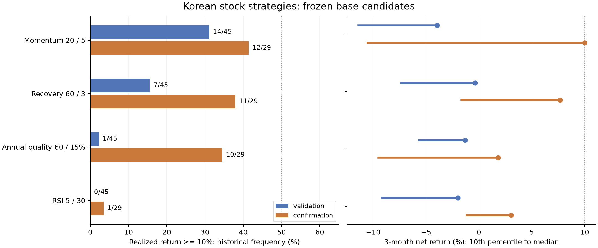

# 2026-09-08 한국 증시: 3개월 10% 목표 탐색 기록

현재까지 **실전 투입을 뒷받침할 후보를 찾지 못했다.** 기존 모멘텀·돌파·RSI의 파라미터 변경과 새 회복 순환·연간 실적 결합 모델을 평가했다. 개발 69개 설정, 후속 검증을 포함한 113개 실험, 완료된 3개월 계좌 4,809개를 기록했다. 계좌 시작점과 전략들이 같은 시장을 공유하므로 이 숫자는 독립 표본 수가 아니다. 이 연구 단위의 결과는 보존하지만 “지금부터 3개월에 10%를 낼 전략 하나 찾기”라는 목표는 아직 달성하지 못했다.

현금 1억원, 신용·레버리지 없이 운용하고 계좌 고점 대비 10%에서 중단 신호를 내는 가정이다. 이는 사용자에게서 확정받은 손실 허용치가 아니다. +10.5% 평가이익 뒤 실제 청산을 완료하고 비용 후 10% 이상이어야 성공으로 셌다. 소수점 반올림으로 9.99%를 성공으로 올리지 않았다.

## 지금의 환경

한국은행은 8월 27일 기준금리를 2.75%에서 3.00%로 올렸다. 수출·내수 회복과 물가·금융안정 위험을 함께 언급했다. 미국 연준은 7월 29일 3.50~3.75%를 유지했다. 현재를 저금리 완화 국면으로 해석할 근거는 약하다. [한국은행 결정](https://www.bok.or.kr/portal/bbs/P0000559/view.do?menuNo=200690&nttId=11064191), [연준 결정](https://www.federalreserve.gov/newsevents/pressreleases/monetary20260729a.htm)

8월 소비자물가는 전년비 3.1%로 7월 2.8%에서 높아졌다. 다만 발표자는 전년 통신요금 할인에 따른 기저효과를 제거하면 약 2.5%라고 설명했다. 상승률 확대 전부를 새로운 수요 과열이나 유가 충격으로 해석하지 않았다. [8월 물가 발표](https://www.korea.kr/news/policyNewsView.do?newsId=156777515)

8월 수출은 982.5억 달러, 전년비 +68.7%이고 반도체 수출 증가율은 +209%다. 수출액 증가가 모든 상장사의 이익 증가나 다음 3개월 주가 상승을 뜻하지는 않는다. 반도체 수출 호조를 확인한 뒤에도 현재 시점의 가격 추세와 공개된 연간 실적을 별도로 검사했다. [산업통상부 수출입 동향](https://www.motir.go.kr/kor/article/ATCL3f49a5a8c/172145/view)

중동 긴장과 원유 운송 경로는 에너지 비용의 불확실성을 키운다. EIA 8월 전망은 8월 초에 정한 호르무즈 통항 가정을 포함하므로 9월의 실제 상태를 그대로 보여주는 자료로 사용하지 않았다. 국내 정유사에는 석유제품 가격·수급 안정 조치도 적용되고 있어 고유가만으로 정유주 이익 증가를 단정하지 않았다. [EIA 전망](https://www.eia.gov/outlooks/STEO/), [산업통상부 석유시장 설명](https://www.motir.go.kr/kor/article/ATCLe0854704d/172096/view)

| 관측 또는 계산 | 값 | 자료 시점·의미 |
| --- | ---: | --- |
| 코스피 | 6,954.52 | Npay 9월 8일 종가 |
| 코스피 20거래일 수익 | +10.40% | 단기 반등 |
| 코스피 60거래일 수익 | −14.39% | 중기 조정이 남음 |
| 코스피 최근 20일 연율 변동성 | 45.45% | 일별 단순 수익률의 표본 표준편차 × √252 |
| 코스피 60일 고점 대비 | −23.70% | 과거 고점 대비 낙폭 |
| 브렌트 / WTI 현물 | 96.02 / 91.48달러 | FRED에서 확보한 9월 1일 관측 |
| 원/달러 | 1,379.41원 | FRED 8월 28일 관측. 오늘 현물 환율로 표시하지 않음 |
| VIX | 14.53 | Cboe 9월 4일 관측. 국내 변동성 자체를 대체하지 않음 |

지수 계산과 원문 해시는 로컬 `data/kr-quarter-research/evidence/current-state.json`에 있다. 공개 원문 주소는 [Npay 코스피 차트](https://api.stock.naver.com/chart/domestic/index/KOSPI/day?startDateTime=201001010000&endDateTime=202609082359), [브렌트](https://fred.stlouisfed.org/series/DCOILBRENTEU), [WTI](https://fred.stlouisfed.org/series/DCOILWTICO), [환율](https://fred.stlouisfed.org/series/DEXKOUS), [Cboe VIX 이력](https://cdn.cboe.com/api/global/us_indices/daily_prices/VIX_History.csv)이다.

이 자료들로 현재를 **수출 호조·금리 인상·국내 고변동성·조정 후 단기 반등이 겹친 상태**로 분류했다. 이는 자료를 종합한 연구상 해석이다. 물가·정세의 현재 해석을 과거 매매 신호에 소급하지 않았다.

## 결과

매월 첫 거래일부터 달력 3개월을 재실행했다. 개발 2016~2019년에서 후보를 고정하고 검증 2020~2023년, 확인 2024년 이후로 나눴다. 주식 원자료는 2026년 8월 28일까지여서 확인 구간의 마지막 완결 시작점은 2026년 5월이다. ETF는 9월 8일까지 있어 6월 시작까지 완료된다. 현재 50종목 시세 연장은 오늘 신호 전용으로만 썼다.

아래는 후속 결과를 보기 전에 정한 대표 후보다. 같은 기간 전체 파라미터 결과는 [전체 실험 표](kr-current-quarter-results/all-summaries.csv)에 있다.

| 주식 후보 | 2020~2023 목표 달성 | 2024년 이후 목표 달성 | 최근 3개월 수익 중앙값 | 최근 최악의 3개월 수익 |
| --- | ---: | ---: | ---: | ---: |
| 기존 모멘텀: 20일·상위 5·20일 회전 | 14/45 (31.1%) | 12/29 (41.4%) | +9.99097% | −16.81% |
| 새 회복 모델: 60일·상위 3·20일 회전 | 7/45 (15.6%) | 11/29 (37.9%) | +7.68% | −11.23% |
| 새 실적 결합: 60일·이익 성장 15% | 1/45 (2.2%) | 10/29 (34.5%) | +1.80% | −14.00% |
| 기존 RSI: 5일·진입 30·청산 60 | 0/45 (0.0%) | 1/29 (3.4%) | +3.03% | −6.87% |

확인 구간에서 종료일까지 겹치지 않는 시작점만 남기면 각 후보 9개다. 모멘텀 성공 3/9·중앙값 −8.30%, 회복 모델 2/9·중앙값 +6.77%로, 시작 월의 중첩에 민감하다. 회복 모델의 80일 인접값은 전체 확인 표본에서 14/29 (48.3%)까지 나왔지만, 검증에서는 8/45 (17.8%)였다. 이후 기간에서 가장 높았다는 이유로 기본값을 80일로 바꾸지 않았다.

슬리피지를 편도 5bp에서 20bp로 높여 대표 주식 후보의 확인 구간 58계좌를 다시 실행했다. 모멘텀의 목표 빈도는 41.4%→37.9%, 회복 모델은 37.9%→31.0%로 낮아졌다. 회복 모델의 최악 수익이 일부 개선된 것은 비용 증가가 손절 시점을 바꿔 매매 경로가 달라졌기 때문이다. 비용이 늘면 모든 개별 결과가 일률적으로 나빠진다고 가정하지 않았다.

## 현재와 비슷한 시작점

성과를 계산하기 전에 수출 전년비 +10% 초과, 코스피 20일 양수·60일 음수, 두 조건의 교집합을 정했다. 수출은 OECD 월별 관측의 월초 날짜에서 90일 뒤부터 사용했다. 현재 빈티지의 개정 문제는 남는다. IMF의 다른 월별 수출 계열과 최근 값의 단위·규모도 대조했다. [OECD/FRED 수출 계열](https://fred.stlouisfed.org/series/XTEXVA01KRM667N), [IMF/FRED 수출 계열](https://fred.stlouisfed.org/series/VALEXPKRM052N)

수출 증가와 조정 후 반등의 교집합은 개발에서 2개, 검증에서 2개, 최근 완료 구간에서 0개였다. 기존 월간 모멘텀과 새 회복 모델은 과거 네 시작점 모두 10% 목표에 도달하지 못했다. 반등 조건만 사용하면 최근 2개는 모멘텀이 성공했지만 검증에서는 5개 중 1개였다. 작은 표본에서 나온 100%를 현재의 성공 확률로 사용하지 않았다.

더 넓은 수출 증가 조건에서도 기존 월간 모멘텀은 검증 2/17, 최근 2/9 성공이었다. 현재 상황을 고려해도 전체 표본의 약한 결과를 뒤집을 근거가 나오지 않았다. 모든 조건별 결과와 시작 날짜는 로컬 `data/kr-quarter-research/evidence/context-analysis.json`에 보존했다.

## 오늘 계산한 새 회복 모델의 신호

실전 채택 기준에는 미달했다. 다음은 구현과 현재 자료가 연결되는지 확인한 **연구 후보의 목표 비중**이다.

| 종목 | 코드 | 9월 8일 종가 | 계산된 목표 비중 |
| --- | --- | ---: | ---: |
| S-Oil | 010950 | 159,400원 | 22.16% |
| 메리츠금융지주 | 138040 | 130,800원 | 22.16% |
| 하나금융지주 | 086790 | 136,800원 | 22.16% |
| 현금 | | | 33.53% |

60일·20일 수익이 모두 양수이고 20일 평균 위에 있는 종목을 변동성 대비 수익으로 순위 매긴다. 선택 종목의 평균 변동성으로 전체 주식 비중을 제한하며 목표 연율 변동성은 30%다. 유가·환율 급변 또는 VIX 상승 시 목표 비중을 낮추고, 금리 상승과 유가 상승이 함께 있으면 최대 주식 비중을 85%로 제한한다. 코스피 회복 조건 이탈·종목 진입가 대비 8% 하락·계좌 고점 대비 10% 하락에서 청산 신호를 낸다. 손절은 다음 거래 가능일 체결이므로 수치가 실제 손실 상한은 아니다.

오늘은 순위와 목표를 정하는 단계다. 다음 실제 거래일 종가에 조건과 가격을 다시 확인해 매수를 예약하고 그 다음 거래 가능일 시가에 체결을 시도한다. 미래 봉을 만들거나 오늘 가격으로 미래 체결을 확정하지 않았다. RSI 주문 목록도 최대 종목 수·현금·동시 매수 순서 제한 전의 주문 의도로 기록했다.

정유·금융 중심의 오늘 신호는 최근 가격 상대강도가 만든 결과다. 반도체 수출 증가를 근거로 반도체 종목을 임의로 끼워 넣지 않았다. 연간 실적 결합 후보와 RSI의 별도 현재 신호도 `current-signals.json`에 있다.

## 자료 한계와 재현

주식은 과거 월별 종목군을 사용한다. 확인되지 않은 기업행위나 추정 단위 변화가 보유 기간에 걸리면 목표 성공으로 세지 않는다. ETF는 현재 존재하는 업종 대표 14개로 고정했으므로 폐지 상품이 빠진 생존 편향이 남는다. Yahoo 실제 OHLC는 Npay 실제 시세표와 대조·보완했지만 일부 역사적 거래량 출처 차이가 남는다. 주식·ETF 현금 배당과 분배금은 신호와 계좌에 넣지 않았으므로 인증된 총수익이 아니다. ETF의 낮은 거래량으로 만기까지 청산하지 못한 경우는 성공에서 제외했다.

연간 공시 43,236개에서 주식 종목군에 해당하는 관측을 사용했다. 최신 정정 수치를 반환된 접수일 다음 날부터만 사용했으나 과거 최초 공시 빈티지의 완전성은 부족하다. 2014년 연간 자료가 없어 2016년 상당 부분에서는 두 해 실적 조건을 충족시킬 수 없었다. FRED의 발표 지연은 가정이며 월별 물가·정세는 현재 상황 해석에 사용했다. 후속 가설은 이미 다른 후보의 같은 시장 역사를 본 뒤 만들었으므로 완전히 새로운 블라인드 검증이라고 부르지 않는다.

RSI 개발 중 평가 종료 뒤 상장폐지 일정이 전달되는 연구 실행기 오류로 1개 실행이 중단됐다. 실패 기록을 보존하고 기간 밖 일정을 제외해 해당 후보부터 다시 완료했다. 기존 대표 후보의 확인 구간 58계좌를 재실행해 개별 결과 JSON 전체가 원본과 같음을 확인했다. 운영 엔진 코드는 바꾸지 않았다.

원문·입력·모든 계좌·검증 결과는 `data/kr-quarter-research/`, 공유할 요약과 그림은 이 문서 옆 `kr-current-quarter-results/`, 재현 명령은 [연구 스크립트 안내](../../scripts/quarter-research/README.md)에 있다. 실패한 후보를 운영 전략 목록에 등록하지 않았다. 손실 허용치·실제 운용금은 아직 사용자와 확정되지 않았고, 새 데이터나 별도의 검증 근거가 생기기 전까지 위 종목 신호를 실전 권고로 승격할 수 없다.

검증: 관련 TypeScript 테스트 12개 파일·213개 사례와 Python 6개 사례, 연구 파일 ESLint, 서버 범위 TypeScript 검사를 통과했다. 새 폐지 경계 회귀 테스트의 초기 fixture 오류를 수정한 뒤 재검사했다. 전체 저장소 테스트는 실행하지 않았으며 운영 코드는 변경하지 않았다. 상세 기록은 [검증 결과](kr-current-quarter-results/verification.json)에 있다.
