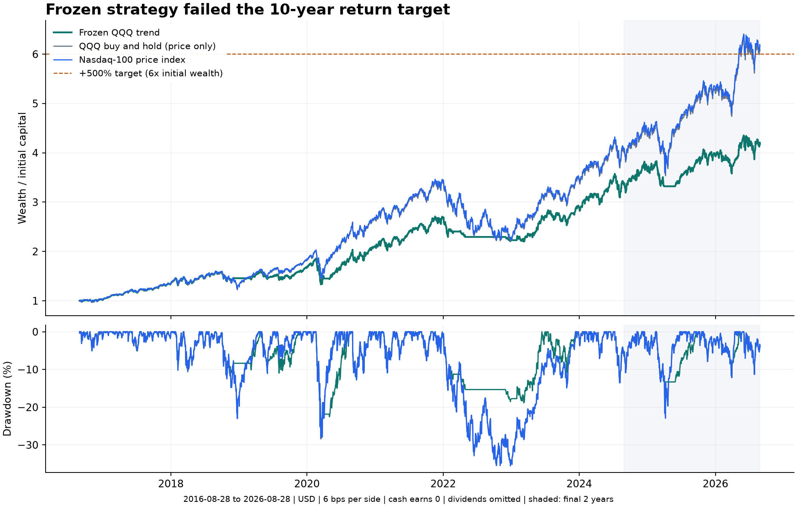

# 10년 초과수익 전략 연구 결과 — 목표 미달

2026-09-06 조사 기준, **10년 +500% 초과와 신뢰도 기준을 함께 충족한 전략은 찾지 못했다.**
전략을 통과한 것처럼 등록하거나 운영에 배포하지 않았다. 운영 DB는 시장 데이터만
읽기 전용으로 조회했고, 계산은 별도 로컬 복제본에서 수행했다.

국내 개발 파라미터 12개와 미국 9개를 비교했다. 규칙을 고정한 뒤 국내 후보는 다음
3년 검증에서 탈락했고, 미국 후보는 중간 검증을 통과했으나 마지막 구간을 포함한
10년 성과에서 탈락했다. 아래 결과를 참고해 새 파라미터를 골라 같은 기간을 다시
‘표본 외’라고 부르지 않는다. 이 결론은 모든 가능한 전략이 불가능하다는 증명이 아니다.

## 기준과 비교

비교 기간은 환율의 마지막 공통 관측일에 맞춰 **2016-08-28~2026-08-28**로 성과 열람
전에 고정했다. +500%는 원금의 6배, 연복리 약 19.62%다. 실제 같은 기간 나스닥100
가격지수 수익은 달러 +515.29%, 원화 환산 +663.61%였다. 미국 후보는 달러끼리 비교한다.
이는 [FRED의 나스닥100 종가](https://fred.stlouisfed.org/series/NASDAQ100)와
[KRW/USD 환율](https://fred.stlouisfed.org/series/DEXKOUS) 원자료로 직접 계산했다.

사용자가 구체적인 수치를 정하지 않은 위험 기준은 연구 기본값으로 초과 샤프 1.0,
최대 낙폭 35%를 두었다. 시장 범위에 대한 응답이 없어 국내에서 시작해 미국 일반 ETF로
확장했으며, 차입·레버리지·공매도는 사용하지 않았다. 이 기본값은 사용자가 지정한
절대 조건과 구별한다. 다만 10년 수익 목표 자체도 미달하므로 샤프 문턱을 낮춰도
아래 후보가 목표를 달성하지는 못한다.

| 평가 대상 | 기간 | 누적 수익률 | 연복리 | 초과 샤프 | 최대 낙폭 |
|---|---|---:|---:|---:|---:|
| 국내 가치·수익성 + 시장 추세, 개발 | 2016-08~2021-08 | +48.55% | 8.24% | 0.56 | -23.79% |
| 같은 국내 규칙, 다음 검증 | 2021-08~2024-08 | **-17.18%** | -6.09% | **-0.74** | -26.70% |
| 미국 QQQ 추세, 개발 | 2011-10~2016-08 | +51.62% | 8.85% | 0.66 | -26.20% |
| 같은 미국 규칙, 8년 검증 | 2016-08~2024-08 | +238.95% | 16.49% | 0.83 | -28.28% |
| 같은 미국 규칙, 마지막 2년 별도 시작 | 2024-08~2026-08 | +23.33% | 11.06% | 0.47 | -13.28% |
| **같은 미국 규칙, 연속 10년 운용** | **2016-08~2026-08** | **+318.28%** | **15.39%** | **0.76** | **-28.28%** |
| QQQ 단순 보유, 같은 비용·현금 조건 | 2016-08~2026-08 | +507.82% | 19.78% | 0.81 | -35.51% |

국내 결과는 기업행위 권리 처리가 인증되지 않은 진단값이다. 미국 결과는 **분배금 제외
가격수익, 투자자 과세 전**이다. 마지막 2년 별도 시작 결과와 8년 결과를 곱한 값은
연속 운용 결과와 다르므로, 전체 10년은 별도로 이어서 계산했다.
QQQ가 가격지수와 비용·분배금 정의가 다르다는 점을 숨겨 ‘벤치마크 초과 전략’으로
제시하지 않았다. ETF 분배금까지 검증한 총수익 비교는 아직 완료되지 않았다.

## 최종까지 검증한 하나의 규칙

연구 후보 이름은 **QQQ 3개 이동평균 추세·현금 전략**이다. 투자 추천이나 통과 전략이 아니다.

- 월말 미국 정규장 종가가 각각 150·200·250거래일 단순평균을 초과하는지 확인한다.
- 참인 신호 수를 3으로 나눈 뒤 99%를 곱한 값을 QQQ 목표 비중으로 정한다.
  따라서 목표 비중은 0%, 33%, 66%, 99% 중 하나다. 잔액은 이자 0의 현금이다.
- 월말 확정 종가로 정수 주문 수량을 정하고, 다음 거래일 시가에 매도 후 매수한다.
  시가 상승으로 잔액이 부족하면 매수 수량을 줄인다. 최초 진입도 직전 확정 종가만 쓴다.
- 편도 수수료 1bp와 슬리피지 5bp를 차감한다. 미국 기본 원금은 10만 달러다.
  ETF 보수는 시장가격에 반영되므로 중복 차감하지 않는다.
- 예측 모델 학습, 동률 종목 선택, 최적화 난수는 없다. 체결 현실성에 관한 난수는
  별도 스트레스로 평가했다.

금 ETF를 방어 자산으로 넣는 후보와 QQQ·GLD 상대 모멘텀 후보도 **개발 구간에서만**
비교했다. 가족별 0.8/1.0/1.2 창 배율의 샤프 중앙값으로 가족을 선택하고, 기본 배율
1.0을 유지했다. 최종 성과를 보고 금 비중이나 다른 창으로 갈아타지 않았다.

추세 규칙은 2022년 손실을 -16.69%로 줄였다(NDX -32.97%). 그러나 2019년에는
+14.45% 대 +37.96%, 2020년 +26.48% 대 +47.58%, 2023년 +31.18% 대 +53.81%로
반등 수익을 놓쳤다. 손실 방어만으로 초과수익이 확보되지 않았다.

## 파라미터·난수·표본 불확실성

최종 규칙을 바꾸지 않고 전체 10년에 157개 민감도 실행을 추가했다. 같은 기본값이
여러 범주에 반복되므로 157개의 독립 전략을 발견했다는 뜻이 아니다.

| 변경 | 실행 수 | 누적 수익률 범위 | 초과 샤프 범위 |
|---|---:|---:|---:|
| 모든 이동평균 창에 0.8~1.2 배율, 0.05 간격 | 9 | +315.08~351.74% | 0.754~0.834 |
| 체결을 신호 다음 1~3거래일로 지연 | 3 | +286.54~318.28% | 0.709~0.757 |
| 수수료·슬리피지 1·2·4배 | 3 | +308.60~318.28% | 0.744~0.757 |
| 신호일을 월말 기준 -3·-1·0·1·3거래일로 이동 | 5 | +302.23~354.71% | 0.738~0.805 |
| 현금 여유 0·1·3% | 3 | +307.39~323.98% | 0.754~0.758 |
| 주문 순서 난수 | 30 | 모두 +318.28% | 모두 0.757 |
| 1~3일 임의 체결 지연 + 2.5~7.5bp 임의 슬리피지 | 100 | +269.47~324.88% | 0.685~0.764 |
| 원금 1천·1만·10만·100만 달러 | 4 | +267.80~318.72% | 0.721~0.757 |

한 자산만 거래하므로 주문 순서 난수의 영향이 없는 것은 당연하다. 경제적으로 의미 있는
체결 경로 100개에서는 누적 수익률 폭이 약 55.4%p였다. 정수 수량 때문에 소액 원금은
별도로 불리했다. 창 선택에 따른 좁은 샤프 범위도 목표 미달을 바꾸지는 않는다.

21·63·126거래일 원형 블록으로 실제 관측 일수익률을 벤치마크와 함께 5,000회씩
재표본했다. 63일 블록의 샤프 95% 구간은 **0.25~1.33**, 연복리 초과수익 구간은
**-12.41~+2.22%p**였다. 재표본 중 NDX를 앞선 비율은 10.24%다. 이는 **미래 승률이
아니며**, 새 시장 역사도 아니다. 이미 선택한 규칙의 관측 경로에 조건부인 진단이다.

과거 위기 확인에는 실제 ETF 시가를 확보하지 못해 NDX의 **다음 거래일 종가**를
가상 체결값으로 썼다. 닷컴 구간(2000-03~2003-03) 추세 규칙 MDD -39.19%, 단순 보유
-82.90%; 금융위기 구간(2007-10~2009-03) -27.78% 대 -53.71%였다. 이것은 ETF 실거래
백테스트가 아니다. 최근 10년의 -28% 낙폭이 미래 손실 상한이라는 주장도 불가능하다.

전체 탐색에는 7개 전략 가족/확장과 개발 파라미터 21개가 포함되었다. 기록된 성과
파일은 26개이며, 위 민감도 157개와 위기 대용치 4개는 별도다. 이들은 서로 강하게
의존한다. [Deflated Sharpe Ratio 논문](https://doi.org/10.2139/ssrn.2460551)의 선택 편향
문제를 고려하되, 불완전한 최초 공시 이력과 의존적인 시도를 단일 보정값으로 인증하지 않았다.

## 데이터 감사와 남은 한계

운영 시장 스냅샷에는 일봉 **6,580,591행**, 선정 지표 **6,789,009행**, 종목 마스터
35,564버전, 과거 보통주 2,939코드가 포함됐다. 사용자·인증·세션·계좌 테이블은 추출하지 않았다.
허용 테이블만 한 읽기 트랜잭션으로 추출하고 압축 해시·행 수·완료 표식을 검증했다.

추가로 DART 2015~2025년 연간 재무를 330개 배치로 조회해 연결·별도 43,236개
관측을 정규화했다. 사전 표본·회사코드 조회를 합하면 DART 추가 호출은 333회다.
운영 일일 사용량과 합산 제한을 확인하면서 조회했다. [공식 주요계정 API](https://opendart.fss.or.kr/guide/detail.do?apiGrpCd=DS003&apiId=2019017)는
회사당 당시 원문 버전 전체를 복원하는 API가 아니다. 반환 접수일 이후만 사용하고
오래된 정정 공시가 새 사업연도 재무를 대체하지 못하게 했지만, 최초 공시 원본의
완전한 복원과 당시 누락 여부까지 해결된 것은 아니다.

운영 기업행위 정렬 함수를 그대로 재사용했을 때 미정렬 항목 **171개**가 남았다.
삼성전자 2018년 50:1 분할의 관련 원천 사실 누락도 확인했다. 독립 차트로 역사적
유동성 기준 통과 종목 2,430개를 대조했으나, 권리·합병·상장폐지 회수금까지 검증한
총수익 시계열은 아니다. 확인되지 않은 활동 종목 가격 공백은 24개였다. 수정주가에서도
절대 35% 이상 변화 382개가 남았으며, 이 수는 오류 개수와 같지 않다.

미국 QQQ·GLD 자료는 각각 2010-07-09~2026-08-28, 4,060거래일로 날짜와 중첩 응답이
일치했다. GLD 2021-05-05 시가가 저가보다 낮은 1행은 기록했고, 해당 시가를 실제 주문에
쓰면 실패하도록 했다. 최종 QQQ 단독 후보는 이 값을 쓰지 않았다. 분배금·당시 원문
정정 이력은 아직 검증되지 않았다. 운용사 GLD 자료 다운로드는 접근 제한, Yahoo는
요청 제한, Stooq는 정상 자료 확보 실패로 원자료를 확보하지 못했다. 우회하지 않았다.

미국 샤프의 단기 금리는 [DTB3](https://fred.stlouisfed.org/series/DTB3)의 전일 관측값이다.
이는 할인율이므로 실제 단기 국채 투자 수익과 차이가 있다. 국내 금리는 2개월 지연한
3개월 은행간 금리 대용치다. 배당·원천징수·양도소득 과세·환전 비용·주문 거부·실시간
호가 깊이까지 반영한 계좌 성과가 아니다. 100경로 스트레스도 가능한 모든 장애를
포함하지 않는다. 최신 API의 정정 가능성과 현재 시점의 시장 지식으로부터 완전히
자유로운 연구라고 주장하지 않는다.

## 검증·산출물과 다음 연구 조건

연구 테스트 17개가 정보 시점, 다음 시가, 갭 상승의 잔액 제한, 분할 경제가치 보존,
상장 종료 회수 0, 데이터 오류 차단, 읽기 전용 추출, 미완료 스트림 거부와 API 예산 소진 시 외부 요청 중단을 검증했다.
미국 최종 코드를 다시 실행한 일별 평가금액은 보존 결과와 정확히 일치했고, 체결
장부를 별도로 재생한 일별 현금·보유 평가도 일치했다. 저장소 lint·typecheck·1,967개
테스트·build가 통과했다. 기존의 번들 크기 경고는 남았다.

- [사전 규칙과 순차 결정 기록](reliable-ten-year-strategy-protocol.md): 로컬 연구 중 기록이며 공개 시각 인증은 아니다.
- [모든 요약 수치·민감도·원문 해시](reliable-strategy-results.json): 원문 시세와 인증 정보는 제외했다.
- [연구 실행 방법](../../scripts/research/README.md): 원자료는 저장소 밖 별도 디렉터리에 보관한다.

신뢰도를 우선하면 이번 후보를 탈락시키는 것이 맞다. 다음 연구에는 최초 공시 버전과
기업행위 권리를 확정한 자료, 배당을 검증한 ETF 총수익 자료, 그리고 이미 열람한
검증 구간과 구별되는 전진 검증이 필요하다. 레버리지 확대나 최근 승자 종목 추가만으로
+500%를 만들고 이를 검증된 초과수익으로 제시하지 않는다. **목표는 미달 상태다.**
