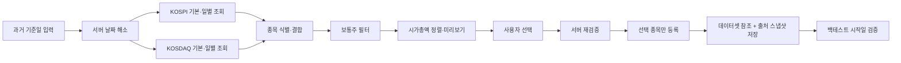

# 과거 시점 고정 유니버스 구성 검토

> 기준일: 2026-08-02 \
> 상태: 제품 설계 확정 — KRX 인증·사용권·실응답 검증 전까지 구현 보류 \
> 대상: 데이터셋 종목 구성, KRX 시장 데이터 연동, 백테스트 입력 검증 \
> 기준 커밋: `aeb4064` \
> 관련 검토: [BACKTEST_BIAS_REVIEW.md](./BACKTEST_BIAS_REVIEW.md)의 B-001·B-002·B-007 및 P-002

## 처음 읽는 사람을 위한 결론

현재 살아 있는 종목을 오늘의 시가총액으로 골라 과거 기간에 적용하면, 백테스트
엔진이 미래 봉을 읽지 않더라도 **종목 선정 단계에서 이미 미래 정보가 유입된다.**
예를 들어 2026-08-01에 만든 현재 목록(최근 거래일 2026-07-31의 시가총액 상위
200종목)으로 2025-01-01~2025-07-01을 테스트하면, 2026년까지 생존하고 커진
기업을 과거에 미리 알았던 셈이다.

이를 줄이기 위한 첫 단계로 다음 기능을 확정한다.

1. 데이터셋을 만들 때 사용자가 **과거 기준일**을 지정한다.
2. KRX Open API에서 그 날짜에 존재한 KOSPI·KOSDAQ 보통주와 해당 거래일의
   시가총액을 조회한다.
3. 시가총액 내림차순으로 정렬하고, 후보 값이 완전할 때 사용자가 상위 200종목 등을
   선택한다.
4. 선택한 종목과 함께 요청 기준일, 실제 적용 거래일, 정보 사용 가능 시점, KRX
   식별자, 당시 시가총액과 순위를 저장한다.
5. 이 데이터셋은 백테스트 전 기간에 동일하게 적용되는 **고정 유니버스**다.
6. 종가 기준 스냅샷은 다음 거래 세션부터 사용한다. 1차 구현은 보수적으로 실제
   적용일이 백테스트 시작일과 같거나 늦으면 제출을 차단한다.

이 기능은 현재 생존 종목만 사용하는 문제를 크게 완화하지만, 백테스트 기간 중
시가총액을 다시 계산해 편입·편출하는 동적 유니버스나 상장폐지 회수액 처리를
구현하는 것은 아니다. 따라서 결과 화면에서 “생존자 편향을 제거했다”고 표현하지
않고, “과거 시점에 고정한 유니버스”라고 정확히 표시한다.

## 1. 문제 정의

### 1.1 잘못된 설정의 예

| 항목 | 값 |
| --- | --- |
| 데이터셋 구성 시점 | 2026-08-01 |
| 구성 기준 | 최근 거래일 2026-07-31의 시가총액 상위 200종목 |
| 백테스트 기간 | 2025-01-01~2025-07-01 |
| 발생하는 문제 | 2026년의 생존 여부와 기업 규모를 2025년 종목 선택에 사용 |

이 경우 왜곡은 전략 로직보다 먼저 발생한다. 전략이 전고점 돌파처럼 재무정보도,
리밸런싱 시가총액도 사용하지 않더라도 **입력 후보군 자체**가 미래를 반영했기
때문이다. 엔진 내부의 미래 참조 방지만으로는 이 문제를 발견할 수 없다.

### 1.2 세 가지 유니버스 수준

| 방식 | 의미 | 판단 |
| --- | --- | --- |
| 현재 생존 종목 고정 | 오늘 구성한 목록을 과거에 소급 적용 | 간단한 도구와 개인 연구에서 흔하지만 신뢰도 낮음 |
| 과거 단일 시점 고정 | 백테스트 시작일 전 거래일 또는 그 이전 시점의 목록을 전 기간에 고정 | 이번에 구현할 1차 범위 |
| 시점별 동적 유니버스 | 기간 중 상장·폐지·규모 변화에 따라 편입·편출 | 더 엄밀하지만 별도 후속 설계 필요 |

“현재 살아 있는 종목을 기준으로 돌리는 방식”은 데이터 구하기가 쉬워서 일반적인
스크립트, 튜토리얼, 소규모 백테스터에서 실제로 자주 나타난다. 다만 전문적인
검증에서 권장되는 기준은 아니다. 점진적 개선 순서는 현재 목록 고정 → 과거 스냅샷
고정 → 시점별 동적 유니버스다.

## 2. 현재 구현에서 확인한 원인

- `src/server/modules/market-data/application/symbol-metrics-service.ts`의 시가총액은
  현재 발행주식수와 현재가를 곱해 만든 **현재 값**이다.
- 거래대금·거래량 지표도 현재 랭킹 응답이며, 과거 시점 재현용으로 저장하지 않는다.
- `src/server/shared/db/schema.ts`의 `dataset_symbols`는 데이터셋과 종목의 참조만
  보유한다. 그 종목을 **어느 날짜·어느 출처·어느 기준으로 골랐는지**는 남지 않는다.
- `src/shared/schemas/backtest-request.ts`의 유니버스는 최대 200개의 명시적 종목
  목록이며, 그 목록의 시점 적합성을 판정할 정보가 없다.
- 실행 시에는 명시적 종목과 종목별 데이터 버전을 고정하지만, 종목 목록을 고른
  근거까지 고정하지는 않는다.
- 일반 위저드는 데이터셋 전체를 요청하지만 서버 계약은 부분집합도 허용한다. 이때
  현재 버전 스냅샷은 실제 요청 종목이 아니라 데이터셋 전체를 잡으므로, 레거시 복제나
  직접 API 요청에서는 소비 종목과 버전 해시가 어긋날 수 있다. 과거 유니버스 기능을
  넣기 전에 실제 해소된 실행 종목만 버전 고정하도록 함께 바로잡아야 한다.
- 데이터셋 생성 요청은 최대 1,000종목이지만 편집 요청은 add/remove 배열 각각만
  1,000으로 제한하고 최종 구성원 수는 검사하지 않는다. 1,000을 제품 상한으로 쓸
  경우 생성·편집이 공유하는 쓰기 경계에서 새 불변식으로 강제해야 한다.

이는 D-034의 “종목은 1급 객체, 데이터셋은 참조 집합” 원칙과 충돌하지 않는다.
`dataset_symbols`는 계속 참조만 보유하고, **선정 출처와 당시 관측값은 별도의
provenance/snapshot 구조**로 추가하는 것이 맞다.

또한 D-038에서 현재 시가총액 지표를 백테스트 입력으로 저장하지 않은 판단도
유효하다. 현재 값과 과거 스냅샷 값은 의미와 수명이 다르므로 기존
`SymbolMetricsService`를 과거 조회용으로 확장하지 않는다.

## 3. KRX Open API로 가능한 범위

### 3.1 확인된 공식 API

KRX Open API의 공식 서비스 목록과 공개 명세에서 다음 네 서비스를 확인했다.

| 시장 | 서비스 | 필요한 주요 필드 | 공식 제공 시작일 |
| --- | --- | --- | --- |
| KOSPI | 종목기본정보 | 기준일, 표준코드, 단축코드, 종목명, 상장일, 시장·증권 구분, 주식 종류, 상장주식수 | 2010-01-04 |
| KOSDAQ | 종목기본정보 | 위와 같음 | 2010-01-04 |
| KOSPI | 일별매매정보 | 기준일, 단축 종목코드, 거래량, 거래대금, 시가총액, 상장주식수 등 | 2010-01-04 |
| KOSDAQ | 일별매매정보 | 위와 같음 | 2010-01-04 |

일별매매정보에는 `MKTCAP`이 있으므로 특정 거래일의 시가총액을 직접 사용할 수
있다. `ACC_TRDVOL`과 `ACC_TRDVAL`도 제공되지만 이번 정렬에는 넣지 않는다.
하루 거래량·거래대금은 전략이 요구하는 관측 기간에 따라 의미가 크게 달라지고,
임의의 전 거래일 값으로 순위를 만들면 또 다른 왜곡을 만들 수 있기 때문이다.

종목기본정보의 공개 명세에는 표준코드 `ISU_CD`, 단축코드 `ISU_SRT_CD`, 상장일
`LIST_DD`, 시장·증권·주식종류 구분과 상장주식수 등이 포함된다. 반면
일별매매정보의 `ISU_CD`는 이름과 달리 단축 종목코드 의미다. 따라서 조인은
`(시장, 적용일, daily.ISU_CD = basic.ISU_SRT_CD)`로 1:1 검증하고, 영구 식별자는
기본정보의 표준코드 `basic.ISU_CD`에서 가져와야 한다.

공식 페이지에 공개된 기본정보 조회 구조는 기준일이 종목 유효기간 안에 있는지를
기준으로 조회하므로, **현재는 상장폐지됐더라도 해당 기준일에 유효했던 종목을
반환할 수 있는 구조**다. 다만 이것은 시점 유효 종목 마스터이지 상장폐지일·사유·
정리매매·회수 대가 이력 API는 아니다.

따라서 공개 명세 기준으로 다음 두 정보를 결합할 수 있을 것으로 판단한다.

- 과거 특정 시점에 종목이 존재했는가: 그 기준일의 종목기본정보로 확인할 수 있다.
- 그 시점의 시가총액은 얼마였는가: 해당 거래일의 일별매매정보 `MKTCAP`으로
  확인할 수 있다.

다만 인증키 없이 확인한 것은 공개 명세, 샘플 응답, 서비스 기간과 조회 구조다.
실제 전체 응답에서 상장폐지 종목이 기대대로 포함되는지, 보통주·SPAC·REIT·DR을
가르는 필드 값이 시기별로 일관적인지는 **기능 활성화 전에 실데이터로 검증해야
하는 필수 게이트**다. 이 검증을 통과하기 전에는 “KRX에서 과거 상장폐지 종목까지
완전히 복원한다”고 확정적으로 표현하지 않는다.

### 3.2 별도 데이터 구입 여부

공식 이용 절차에는 회원가입, 인증키 신청, API별 이용 신청·승인이 명시되어 있고,
별도의 유료 데이터 상품 구입은 Open API 사용의 선행 조건으로 표시되어 있지 않다.
따라서 현재 프로젝트처럼 개인이 비상업적으로 사용하는 범위에서는 별도 데이터
구입 없이 사용할 수 있는 것으로 판단한다.

그러나 이를 “제약 없는 무료 데이터”라고 표현하면 안 된다. 공식 약관에는 다음
제약이 있다.

- API 이용기간은 원칙적으로 인증키 제공일부터 1년이며 연장 승인이 필요하다.
- 일일 호출 한도는 인증키당 10,000회다.
- 비상업적 이용을 전제로 하며, 데이터를 제3자에게 제공하거나 이를 이용해 요금을
  받는 행위는 금지된다.
- 이용기간 만료·해지 뒤에는 제공받은 정보를 이용할 수 없다고 약관에 명시돼 있다.
- 서비스의 완전성·연속성이 보장되지 않는다.
- 데이터를 표시할 때 출처를 `한국거래소 통계정보`로 밝혀야 한다.

향후 이 애플리케이션을 공개 서비스나 유료 서비스로 전환하거나 KRX 원자료를
재배포한다면 구현 여부와 별개로 KRX와 이용계약·라이선스를 다시 확인해야 한다.
또한 이 설계는 당시 시가총액과 출처를 로컬에 저장하므로, **개인용 로컬 저장·파생
순위·백테스트 재사용이 승인 범위에 포함되는지와 이용기간 종료 후 차단·보존 방식을
KRX에 확인하는 것**을 구현 선행 게이트로 둔다. 별도 유료 상품 구입이 선행 조건에
표시되지 않는다는 사실이 장기 저장이나 계약 종료 후 재사용 권리를 뜻하지는 않는다.

## 4. 확정 범위

### 4.1 포함 시장과 종목

- 시장은 KOSPI와 KOSDAQ만 포함한다.
- 해당 기준일에 유효한 **일반 보통주**만 후보로 삼는다.
- 우선주, REIT, SPAC, DR, 펀드 및 ETF·ETN·ELW 같은 주권 외 상품은 제외한다.
- KONEX는 이번 범위에서 제외한다.
- 필터는 종목명 문자열 추측보다 KRX의 시장·증권그룹·섹션·주식종류 필드를
  우선한다.
- 이 분류 필드가 한국어 명칭 문자열로 제공될 수 있으므로 원문을 보존하고 여러
  연도의 fixture로 허용값을 검증한다.
- SPAC처럼 하나의 필드만으로 분류되지 않을 수 있는 유형은 공식 필드 조합을
  실응답에서 입증한 뒤 활성화한다. 입증 전에는 과거 유니버스 기능 자체를 열지
  않는다.
- 알려지지 않은 분류값이 나타나면 조용히 제외하지 않고 스냅샷 전체를 실패시켜
  필터 정책 갱신을 요구한다.

필터 규칙에는 버전을 부여해 저장한다. KRX 분류값이나 정책이 바뀌더라도 과거에
만든 데이터셋이 어떤 규칙으로 구성됐는지 설명할 수 있어야 한다.

### 4.2 날짜 의미

사용자가 입력한 날짜와 실제 데이터 날짜를 구분한다.

- `requested date`: 사용자가 입력한 달력 날짜
- `effective trading date`: 시가총액을 관측한, 요청일 이하의 가장 가까운 거래일
- `usable from`: 종가 기준 정보가 공개되어 전략 입력으로 안전하게 쓸 수 있는 시점

날짜는 KST 달력일로 해석한다. 주말이나 휴장일을 입력하면 일별 응답을 제한된 범위
안에서 뒤로 탐색해 이전 거래일로 이동하고 두 날짜를 화면과 저장소에 모두 남긴다.
저장소에는 완전한 거래소 휴장일 달력이 없으므로 탐색은 최대 31일로 제한하고,
동일 날짜 동시 요청은 single-flight로 합친다. 2010-01-04 이전 날짜는 공식 제공
범위 밖이므로 차단한다. 미래 날짜와 아직 공식 데이터가 완전히 공개되지 않은
최근 거래일도 이전 날짜로 조용히 대체하지 않고 차단한다.

`MKTCAP`은 해당 거래일 종가 기준 값이고 최신 전 거래일 데이터는 공식 안내상 다음
날 08시 이후 제공된다. 이번 1차 구현은 시각별 전략 규칙을 복잡하게 만들지 않고,
**effective trading date가 백테스트 시작 달력일보다 반드시 이전**이어야 한다는
보수적 규칙을 쓴다. 즉 기준일 D의 스냅샷은 D 다음 거래 세션부터 사용할 수 있다.

KOSPI와 KOSDAQ 중 한 시장만 성공하거나 서로 다른 적용일로 해소되면 후보군을
만들지 않는다. 두 시장의 같은 거래일 응답이 모두 준비된 경우에만 하나의 원자적
스냅샷으로 취급한다.

### 4.3 정렬과 선택

1. 보통주 필터를 먼저 적용한다.
2. 시가총액이 있는 종목을 `MKTCAP` 내림차순으로 정렬한다.
3. 시가총액이 같으면 단축코드 오름차순으로 정렬해 완전순서를 만든다.
4. 시가총액이 없는 값은 0으로 바꾸지 않고 `unknown`으로 분리해 뒤에 둔다.
5. 후보 보통주에 unknown이 하나라도 있으면 시장 전체의 정확한 상위 N을 증명할 수
   없으므로 “시가총액 상위 200종목 선택”을 비활성화한다.
6. unknown 종목은 경고와 함께 수동 선택할 수 있지만, 그 데이터셋의 최초 선정
   방식은 `MANUAL_FROM_KRX_SNAPSHOT`으로 기록한다.

KRX 숫자는 문자열 응답이다. 빈 문자열·`-`는 nullable 필드에서만 unknown으로
해석하고, 비정수·음수·64비트 범위 초과는 응답 계약 오류로 처리한다. 시가총액
원문은 원 단위 64비트 정수로 보존한다. 화면에서 반올림해 표시하더라도 정렬과
순위는 반올림 전 값으로 계산한다.

과거 모드를 추가할 때 데이터셋 최종 구성은 1~1,000종목이라는 공통 불변식을
생성·편집 모든 경로에 도입한다. “상위 200”은 검색·페이징과 무관한 전체 적격
후보를 대상으로 하는 빠른 선택이며 검색은 선택을 지우지 않는다. 201종목 이상을
수동 저장할 수는 있지만 현재 백테스트 상한 200을 넘으면 위저드가 차단하고 임의로
잘라내지 않는다.

### 4.4 고정 유니버스 의미

선택한 목록은 백테스트 기간 전체에 고정된다. 기간 중 시가총액 변동, 신규 상장,
상장폐지에 따라 자동으로 편입·편출하지 않는다. 이것은 “기준일 당시 알 수 있었던
후보군에 전략을 적용한다”는 실험이며, 매월 또는 매년 시가총액 상위 N종목으로
리밸런싱하는 실험과는 다르다.

## 5. 제안 데이터 흐름

세부 원칙은 다음과 같다.

1. 브라우저는 기준일, 서버가 발급한 불투명 `snapshotId`와 선택한 KRX 표준코드만
   의사 표현으로 보낸다. 시가총액, 순위, 시장, 종목 종류처럼 신뢰 경계를 넘는 값은
   서버가 계산한다.
2. 서버는 KOSPI·KOSDAQ 기본정보와 일별매매정보를 모두 받은 뒤 시장·적용일·단축
   코드로 1:1 결합하고, 기본정보의 표준코드를 영구 식별자로 승격한다.
3. 미리보기는 DB 무쓰기(read-only)다. 후보 종목을 `symbols`, `datasets`, provenance
   어느 곳에도 등록하지 않는다.
4. 사용자가 최종 선택한 종목만 등록하고 데이터셋에 연결한다.
5. 저장 직전 서버는 `snapshotId`의 정규화 내용 해시와 선택 표준코드를 확인한다.
   캐시 만료·프로세스 재시작·KRX 정정으로 사용자가 본 내용이 달라졌다면 조용히
   새 결과로 저장하지 않고 미리보기를 다시 요구한다. 클라이언트가 보낸 시가총액이나
   순위는 받지도, 신뢰하지도 않는다.
6. 외부 조회가 모두 끝난 뒤 새 저장 조정자가 하나의 DB 트랜잭션을 소유해 종목 등록,
   데이터셋 참조, provenance와 선정 스냅샷을 함께 저장한다. 현재처럼 각 서비스가
   별도 트랜잭션과 즉시 감사를 수행하는 조합을 순서대로 호출해서는 원자성을 만들 수
   없다.

기본정보에는 있으나 일별정보가 없는 적격 종목은 시가총액 unknown으로 남긴다.
반대로 일별정보에만 있는 종목, 중복 조인, 시장 불일치, 상충하는 핵심 식별자는
분류 안전성을 잃으므로 스냅샷 전체를 실패시킨다.

동일한 실제 거래일·필터 정책 버전·응답 계약 버전에 대한 성공 응답은 정규화한 뒤
캐시해 호출량을 줄인다. 캐시 항목은 `snapshotId`, canonical hash, 조회 시각을 가진다.
한 시장 조회 실패, 파싱 실패, 불완전 응답은 캐시된 정상값처럼 취급하지 않으며
부분 후보군도 반환하지 않는다.

## 6. 컴포넌트 경계

### 6.1 새 시장 데이터 어댑터

`KrxHistoricalUniverseSource`를 별도 포트/어댑터로 둔다. 책임은 다음으로 제한한다.

- 서버 환경에서 인증키를 읽고 KRX API를 호출한다.
- KOSPI·KOSDAQ 기본정보와 일별매매정보의 원문 계약을 검증한다.
- KRX 필드를 내부 원시 모델로 변환한다.
- 호출 실패, 이용 제한, 응답 형식 변경을 구분 가능한 오류로 반환한다.

기존 `SymbolMetricsService`는 등록 종목의 **현재 화면용 지표**라는 의미를 유지한다.
두 서비스를 합치면 캐시 수명, 실패 정책, 저장 여부와 시점 의미가 뒤섞이므로 분리한다.

### 6.2 애플리케이션 서비스

`HistoricalUniverseService`가 다음 정책을 담당한다.

- 요청일을 실제 거래일로 해소
- 양 시장 응답의 원자적 결합
- 시장·적용일·단축코드 기반 기본정보·일별정보 1:1 조인 및 표준코드 승격
- 보통주 포함·제외 정책 적용
- null 시가총액 처리와 결정적 순위 계산
- 미리보기와 저장 시 동일 스냅샷 검증
- 동일 거래일 캐시 조정

KRX 응답 필드명이나 HTTP 세부사항은 이 서비스 바깥의 어댑터에 머문다. 반대로
“보통주만”, “unknown은 0이 아님”, “양 시장 중 하나라도 실패하면 전체 실패” 같은
제품 정책은 어댑터가 임의로 결정하지 않는다.

## 7. 데이터 모델과 재현성

정확한 테이블·컬럼 이름은 구현 계획에서 확정하되, 논리적으로 다음 정보를 분리해
보존해야 한다.

### 7.1 데이터셋 유니버스 출처

데이터셋당 다음 provenance를 저장한다.

- 출처 종류: `KRX_HISTORICAL_SNAPSHOT`, `CURRENT_REGISTERED`, `MANUAL_OR_LEGACY`
- 사용자가 요청한 날짜
- 실제 적용 거래일
- 보수적으로 계산한 `usable from`
- 포함 시장
- 필터 정책 및 버전
- 정렬 기준과 방향
- 생성 시각
- 수동 변경 여부와 최초 수동 변경 시각
- 원본 선정 집합의 무결성 해시
- 최초 선정 방식: `TOP_MARKET_CAP_N` 또는 `MANUAL_FROM_KRX_SNAPSHOT`
- 최초 선택 N과 선택 종목 수
- 전체 적격 후보 수, 유형별 제외 수, unknown 수
- 데이터셋 구성원 revision
- 정보 사용 가능 규칙과 KRX 승인 만료일

기존 데이터셋은 소급 추정하지 않고 `MANUAL_OR_LEGACY`로 취급한다. 현재 등록
종목으로 새로 만든 `CURRENT_REGISTERED`도 과거 시점 적합성을 증명하지 못한다.
근거가 없는데 과거 시점 데이터셋인 것처럼 추론하지 않는다.

### 7.2 선정 종목 스냅샷

원래 선택된 각 종목에 대해 다음을 저장한다.

- KRX 표준코드
- 단축코드
- 당시 종목명과 시장
- 실제 적용 거래일
- 당시 시가총액(nullable)
- 당시 결정적 순위(nullable)
- 필터 판정에 필요한 정규화된 종목 유형

현재 `symbols.code`는 단축코드를 기본 식별자로 사용한다. 과거 종목을 안전하게
다루려면 KRX 표준코드를 함께 보존하고 유일성 또는 외부 식별자 매핑을 보장해야 한다.
단축코드만으로 과거·현재 종목을 합치면 코드 재사용이나 종목 변경을 구분하지 못할
수 있기 때문이다. 1차 구현에서는 기존 단축코드가 다른 표준코드와 이미 연결돼 있으면
자동 병합하지 않고 명시적으로 거부한다. 현재 기존 `symbols` 행에는 표준코드가 없으므로
미매핑 행도 같은 단축코드라는 이유만으로 자동 병합하지 않는다. 먼저 KRX 현재
기본정보 등 권위 있는 소스로 표준코드를 검증·백필해야 하며, 검증할 수 없거나 과거와
현재 표준코드가 다르면 별도 종목 정체성 모델 없이는 등록을 차단한다.

`dataset_symbols`는 계속 현재 구성원 참조만 보유한다. provenance와 원본 선정
스냅샷은 별도 구조에 남겨 역할을 섞지 않는다. 전체 적격 후보의 정규화 규칙과
canonical hash도 남겨 “상위 N” 판정의 입력이 바뀌었는지 탐지한다. 전체 원문 후보를
영구 저장할지는 KRX가 승인한 저장 범위를 넘지 않는 경우에만 허용한다.

원본 선정 스냅샷 행은 `symbols` 삭제에 cascade되지 않는 값 스냅샷이어야 한다.
데이터셋을 명시적으로 삭제하면 데이터셋 소유 provenance는 지울 수 있지만, 이미
생성된 잡·실행에는 선택 종목별 표준·단축코드, 당시 이름·시장·시가총액·순위와
provenance 값을 복사하거나 실행이 참조하는 immutable snapshot을 보존해야 한다.
snapshot ID나 hash만 남기고 원본 행을 지우는 것은 재구성이 아니므로 허용하지 않는다.

### 7.3 수동 편집

과거 스냅샷으로 만든 데이터셋도 기존 화면에서 종목을 추가·제거할 수 있다. 다만
한 번이라도 구성원을 수동 변경하면 다음 규칙을 적용한다.

- 원래 KRX 스냅샷과 그 출처는 삭제하거나 덮어쓰지 않는다.
- 상태를 `과거 스냅샷 · 수동 수정됨`으로 표시한다.
- 최초 변경 시각과 감사 기록을 남긴다.
- 이후 원래 목록으로 되돌리더라도 “수동 수정 이력” 표시는 지우지 않는다.
- 데이터셋 편집뿐 아니라 전역 종목 제거처럼 참조를 바꾸는 모든 경로가 같은 규칙을
  거쳐야 한다.
- 이름·설명 변경은 구성원 변경이 아니므로 이 플래그를 세우지 않는다.
- 수동 수정 이후에는 “기준일 당시의 시가총액 상위 N”이라는 보장을 현재 구성 전체에
  적용하지 않고 별도 시점 적합성 경고를 낸다.

이 불변식은 라우트가 아니라 데이터셋 편집과 전역 종목 제거가 공유하는 DB 쓰기
경계 안에서 강제한다. 이렇게 해야 현재 구성과 최초 선정 근거를 동시에 설명할 수
있다.

## 8. 화면 설계

### 8.1 데이터셋 만들기

종목 구성 모드를 명시적으로 나눈다.

- 현재 등록 종목에서 선택
- 과거 KRX 시점으로 구성

KRX 인증키가 없거나 API 승인·이용기간이 유효하지 않으면 두 번째 모드는
비활성화하고 “KRX Open API 인증키와 API별 이용 승인이 필요합니다”라는 이유를
상시 표시한다. 입력을 다 받은 뒤 마지막에 실패시키지 않는다.

과거 모드에서 조회가 성공하면 다음을 보여준다.

- 요청 기준일과 실제 적용 거래일
- KOSPI·KOSDAQ 원시 종목 수
- 보통주 포함 수와 유형별 제외 수
- 시가총액 확인 종목 수와 unknown 수
- 시가총액 고정 내림차순 목록
- unknown이 0일 때만 활성화되는 `시가총액 상위 200종목 선택` 동작
- 이름·코드 검색과 수동 체크 선택

후보 목록의 정렬 기준은 이번 범위에서 시가총액 하나로 고정한다. 현재 지표 화면의
거래대금순·거래량순을 과거 모드에 재사용하지 않는다. 기존 `SymbolCheckList`와
`useSymbolMetrics()`는 등록 종목·현재 지표를 전제로 하므로 그대로 재사용하지 않는다.
검색·페이징 같은 순수 표현 부품만 공유하고, 과거 후보 전용 타입과 서버 정렬 결과를
사용한다.

“상위 200”은 검색 결과가 아니라 전체 적격 후보 기준이다. 검색어나 페이지를 바꿔도
선택은 유지한다. unknown 종목은 자동 선택에는 들어가지 않지만 경고를 확인한 뒤
수동 선택할 수 있다. 선택이 201종목 이상이면 저장은 가능하되 “현재 백테스트 상한을
초과합니다”를 즉시 표시한다.

### 8.2 데이터셋 카드와 상세

다음 배지와 설명을 표시한다.

- `KRX 2025-01-02 기준`
- `고정 유니버스`
- 필요한 경우 `수동 수정됨`

요청일이 휴일이었다면 “요청 2025-01-01 → 적용 2024-12-30”처럼 두 날짜를 함께
표시한다. KRX 기반 목록에는 이용약관에 맞춰 `출처: 한국거래소 통계정보`를 표시한다.
수동 수정 데이터셋은 카드에서부터 “원본 KRX 시점 보장이 현재 구성 전체에는
적용되지 않음”을 표시한다. 기존·현재 등록 종목 데이터셋도 `시점 확인 불가` 배지를
사용해 과거 스냅샷처럼 보이지 않게 한다.

## 9. 백테스트 계약

### 9.1 제출 검증

백테스트 제출 시 서버가 데이터셋 provenance와 현재 구성원 revision을 같은 읽기
스냅샷에서 해소해 다음을 적용한다.

- 과거 스냅샷의 실제 적용 거래일이 백테스트 `period.from`과 같거나 늦으면 차단한다.
- 실제 적용 거래일이 시작일보다 이전이고 이용 승인이 유효하면 허용한다.
- `MANUAL_OR_LEGACY`, `CURRENT_REGISTERED`와 수동 수정된 KRX 데이터셋은 허용하되,
  현재 구성 전체의 시점 적합성을 확인할 수 없다는 경고를 표시한다.
- 과거 KRX 데이터셋에서 선택 종목 하나라도 백테스트 첫 사용 구간의 가격 데이터가
  전혀 없으면 차단한다. 일부 종목을 조용히 제외하면 같은 생존 편향을 다시 만든다.
- 데이터셋이 200종목을 넘으면 현재 정책대로 차단하며 자동으로 자르지 않는다.
- 서버는 새 요청의 유니버스를 현재 데이터셋 전체에서 도출한다. 클라이언트가 보낸
  stale subset은 허용하지 않고, 화면이 본 membership revision과 다르면 새로고침을
  요구한다.
- 새 요청은 `expectedMembershipRevision` 또는 `If-Match`로 화면이 본 revision을
  동시성 precondition으로 보낸다. 이 값은 provenance를 주장하는 입력이 아니라 stale
  화면을 탐지하는 토큰이며, 생략·불일치 시 서버가 거부한다.
- 브라우저 검증과 별개로 서버가 최종 방어선이 된다.

예: 적용 거래일이 2026-07-31인 데이터셋으로 2025-01-01부터 테스트하려는 요청은
명확한 오류와 함께 거부한다. 적용일과 시작일이 모두 2026-07-31이어도 종가 기준
정보는 그날 세션 시작에 알 수 없으므로 거부한다. 2단계 게이트에는 “적용일 X는
시작일 Y보다 이전이어야 합니다. 더 이른 스냅샷을 선택하거나 시작일을 늦추세요”라고
두 날짜와 해결책을 함께 표시한다.

### 9.2 실행 기록 고정

현재처럼 실행에 사용한 명시적 종목 목록과 종목 데이터 버전을 저장하는 것에 더해
다음을 **클라이언트 요청 필드가 아닌 서버 소유 pinned metadata**로 고정한다.

- 데이터셋 유니버스 출처 종류
- 원본 스냅샷 식별자 또는 무결성 해시
- 요청 기준일과 실제 적용 거래일
- 수동 수정 상태
- 필터 정책 버전
- 데이터셋 membership revision
- KRX 이용 승인 만료일과 실행 당시 유효 판정
- 선택 종목별 표준·단축코드, 당시 이름·시장·시가총액·순위의 값 스냅샷

잡 생성 트랜잭션에서 실제 실행 종목, 그 종목만의 데이터 버전, membership revision과
provenance를 함께 고정한다. 실행 후 데이터셋을 편집하거나 삭제하더라도 당시 어떤
선정 근거와 종목 조합을 소비했는지 재구성할 수 있어야 한다. 레거시 부분 유니버스
복제 경로의 “요청 종목과 데이터셋 전체 버전 해시가 다름” 문제도 이때 제거한다.

현재 저장소는 과거 Parquet 물리 버전을 보존하지 않고 버전 drift를 경고한 뒤 현재
데이터를 읽으므로, pinned metadata만으로 **바이트 단위의 정확한 재실행**을 약속하지
않는다. 복제는 원 실행의 선정 조건과 provenance를 유지하되, 종목 데이터 버전이
달라졌으면 기존 정책대로 경고한다. 사용자가 데이터셋을 다시 선택하면 현재 revision과
provenance로 새 요청을 만드는 것이며, 원 실행과 달라졌다면 검토 화면에서 알린다.
물리 데이터까지 동일한 재실행은 별도의 immutable data-version 저장 설계가 필요하다.

### 9.3 결과 문구

결과 화면에는 다음 의미를 분명히 적는다.

> 이 실행은 YYYY-MM-DD의 KRX 종목·시가총액으로 구성한 고정 유니버스를 전체
> 기간에 사용했습니다. 기간 중 시가총액 재산정이나 종목 편입·편출은 수행하지
> 않았습니다.

수동 수정된 데이터셋에는 대신 다음처럼 표시한다.

> 이 실행은 YYYY-MM-DD KRX 스냅샷을 기반으로 하지만 이후 종목 구성이 수동
> 수정됐습니다. 현재 구성 전체의 과거 시점 적합성은 보장되지 않습니다.

“생존자 편향 제거 완료”라는 문구는 사용하지 않는다. 이 기능이 해결하지 않는
항목이 남아 있기 때문이다.

- 기준일 이후 백테스트 기간 중 신규 상장·상장폐지를 반영하는 동적 구성
- 거래정지와 데이터 수집 누락의 구분
- 상장폐지 시 최종 가격, 정리매매, 현금·주식 교환 대가의 처리
- 과거 지수 구성원 복원

과거 KRX 데이터셋에 가격이 전혀 없는 종목은 제출 전에 차단하지만, 기간 중 가격이
끊긴 원인이 실제 상장폐지인지 거래정지·수집 누락인지 판정하는 문제는 여전히 남는다.

특히 과거 유니버스에 상장폐지 종목을 포함해도 해당 종목의 가격 데이터가 중간에
끊겼을 때 마지막 가격으로 계속 평가하는 B-001 문제는 별도다. 실제 회수 가치는
P-002 정책과 필요한 사건 데이터를 구현해야 해결된다.

## 10. 오류·보안·운영 정책

| 상황 | 동작 |
| --- | --- |
| KRX 인증키 없음 | 과거 모드를 비활성화하고 발급·승인 필요 안내 |
| 2010-01-04 이전 요청 | 지원 범위 오류로 즉시 차단 |
| 미래 또는 미공개 거래일 | 조회하지 않거나 공개 대기 오류로 차단 |
| 주말·휴장일 | 가장 가까운 이전 거래일로 해소하고 두 날짜 표시 |
| KOSPI 또는 KOSDAQ 한쪽 실패 | 전체 실패, 부분 후보군 미제공 |
| 응답 필수 필드 누락·형식 변경 | 계약 오류, 저장하지 않음 |
| 미확인 종목 분류·중복/역방향 조인 | 전체 실패, 필터·응답 계약 갱신 요구 |
| 개별 종목 시가총액 누락 | 0으로 치환하지 않고 unknown 처리 |
| unknown이 있는 상태의 자동 top-N | 버튼 비활성화, 수동 선택만 허용 |
| 단축코드가 다른 표준코드와 충돌하거나 기존 행이 미검증 | 검증·백필 전 자동 병합 차단 |
| 승인 만료·해지 | KRX 파생 조회·표시·신규 실행 차단 |
| 일일 한도·속도 제한 | 명확한 운영 오류와 재시도 가능 시점 안내 |
| 저장 도중 실패 | 종목·데이터셋·provenance를 함께 롤백 |

인증키는 서버 환경변수에서만 읽는다. 브라우저 응답, DB, 감사 로그, 일반 오류
메시지에 인증키를 포함하지 않는다. 외부 API 오류를 기록할 때도 요청 헤더를
그대로 직렬화하지 않는다.

일일 10,000회 제한을 고려해 같은 실제 거래일·필터 정책 버전·응답 계약 버전의
성공 스냅샷은 캐시한다. 오류 응답을 장기간 정상 데이터처럼 캐시하지 않고, 운영
화면이나 로그에는 호출 횟수와 한도 오류를 관찰할 수 있는 정보만 남긴다.

승인 범위와 만료일은 서버 운영 메타데이터로 관리한다. 이용기간이 끝나면 KRX에서
파생한 스냅샷의 조회·화면 표시·신규 백테스트 사용을 막고 갱신 또는 별도 승인을
요구한다. 이미 저장한 데이터의 보존·삭제 및 과거 실행 결과 표시 범위는 KRX의 서면
확인을 받아 확정하며, 확인 전에는 자동 삭제나 계속 사용 어느 쪽도 추정하지 않는다.

## 11. 검증 계획

KRX 실서비스를 CI에서 직접 호출하지 않는다. 고정 fixture와 가짜 어댑터로 대부분의
계약을 검증하고, 인증키 발급 후 별도의 수동 smoke test로 실데이터 계약을 확인한다.

### 11.1 단위 테스트

- 주말·휴장일의 이전 거래일 해소
- 31일 탐색 상한, KST 날짜, 동시 요청 single-flight
- 2010-01-04 경계와 미래·미공개일 차단
- 보통주 포함 및 우선주·REIT·SPAC·DR·펀드 제외
- 미확인 분류값의 전체 실패
- KOSPI·KOSDAQ 기본정보와 일별정보의 시장·단축코드 1:1 조인
- 일별 단축코드에서 기본정보 표준코드를 승격하는지 확인
- 미조인·중복 조인·표준코드 충돌 차단
- 시가총액 내림차순, 동률 단축코드 오름차순
- null 시가총액을 0으로 처리하지 않는지 확인
- KRX 숫자 문자열의 빈 값·비정수·음수·64비트 범위 처리
- unknown이 하나라도 있으면 자동 top-N이 잠기는지 확인
- 적용 거래일과 백테스트 시작일의 같음/역전 차단
- 수동 편집 상태가 한 번 설정된 뒤 유지되는지 확인

### 11.2 통합 테스트

- 양 시장이 모두 성공할 때만 후보 스냅샷 생성
- 한 시장 실패 시 후보와 DB 변경이 전혀 남지 않음
- 미리보기만 한 뒤 `symbols`, `datasets`, provenance에 쓰기가 전혀 없음
- 최종 선택 종목만 `symbols`에 자동 등록
- 미선택 신규 후보가 등록되지 않음
- 데이터셋 참조, provenance, 선정 종목 스냅샷의 원자적 저장
- 조작한 시가총액·순위, 만료·불일치 snapshotId를 서버가 거부
- 데이터셋 생성·편집 최종 크기의 1/1,000 경계와 0/1,001 거부
- 데이터셋 편집과 전역 종목 제거가 수동 수정 상태를 남김
- 이름·설명 변경은 수동 수정 상태를 만들지 않음
- 종목 제거 뒤에도 원본 값 스냅샷이 유지됨
- 백테스트 실제 종목 버전, membership revision과 provenance가 함께 고정됨
- expected revision 생략·불일치, stale subset·동시 편집·레거시 부분 유니버스의
  잘못된 pin 차단
- 선택 종목 중 가격 데이터가 전혀 없는 종목이 있으면 제출 차단
- 기존 데이터셋은 시점 불명 경고를 내되 기존 흐름은 유지
- 성공 캐시 키가 적용일·필터·계약 버전을 포함하고 오류는 정상 캐시되지 않음
- 키 없음·승인 만료 시 외부 호출이 없고 키가 로그·감사에 남지 않음

### 11.3 E2E 테스트

- 인증키가 없을 때 과거 모드가 잠기고 이유가 보임
- 휴일 기준일 조회 후 요청일·적용일이 함께 보임
- 시가총액 상위 200종목 선택과 검색·수동 선택이 함께 동작
- 200/201 경계, 검색·페이징 변경 뒤 선택 유지, unknown 수동 선택
- 미래 및 시작일과 같은 스냅샷 데이터셋의 제출이 두 날짜와 해결책을 보여주며 차단됨
- 수동 수정 데이터셋이 카드·검토·결과에서 시점 불명 경고를 유지
- 결과 화면에 고정 유니버스와 비리밸런싱 의미가 표시됨

### 11.4 인증키 발급 후 수동 smoke test

- 네 API의 전체 응답 필드와 숫자 단위를 공식 명세와 대조
- 현재는 상장폐지된 것으로 알려진 종목이 과거 유효일 조회에 포함되는지 확인
- 보통주, 우선주, REIT, SPAC, DR의 실제 분류값을 여러 연도에서 대조
- 일별 `ISU_CD`와 기본정보 `ISU_SRT_CD` 조인 및 표준코드 보존을 대조
- 휴장일, 오래된 거래일, 최근 공개 완료 거래일을 각각 조회
- KOSPI·KOSDAQ 적용일과 종목 수가 합리적인지 확인
- 화면의 `한국거래소 통계정보` 출처 표기와 이용 범위 확인

실응답이 필터 계약을 입증하지 못하면 추측성 이름 필터로 우회해 기능을 열지 않는다.
필요한 공식 분류 데이터나 라이선스가 추가로 확인될 때까지 비활성 상태를 유지한다.

## 12. 구현 보류와 재개 조건

현재는 KRX 인증키가 발급되지 않았으므로 이 문서만 확정하고 코드·DB 마이그레이션·
화면 변경은 하지 않는다. 구현은 다음 조건을 모두 충족한 뒤 재개한다.

1. KRX Open API 인증키가 발급되고 유효하다.
2. KOSPI·KOSDAQ 종목기본정보 및 일별매매정보 네 서비스의 이용 승인이 완료됐다.
3. 서버 환경에 키를 안전하게 주입할 방법이 준비됐다.
4. 실제 전체 응답으로 시장·단축코드 조인, 표준코드 보존과 종목 유형 필터를
   검증했다.
5. 프로젝트의 이용 형태가 비상업적 Open API 약관 범위에 있음을 다시 확인했다.
6. 로컬 snapshot 저장·파생 순위·백테스트 재사용과 승인 만료 후 처리 범위를 KRX에
   확인했다.

조건 충족 후에는 이 REVIEW를 기준으로 별도 구현 계획을 작성하고, 스키마 → 소스
어댑터 → 애플리케이션 서비스 → API/UI → 백테스트 검증 순서로 테스트 주도 구현한다.

## 13. 이번 범위에서 하지 않는 것

- 거래량·거래대금 기반 과거 정렬
- 월별·분기별·연별 시가총액 리밸런싱
- 과거 KOSPI200·KOSDAQ150 등 지수 구성원 복원
- KONEX 및 해외 시장
- 상장폐지 사유·정리매매·회수 대가 모델링
- 거래정지·기업행위·코드 변경 전 이력의 완전한 사건 모델
- KRX 원자료의 외부 재배포 또는 유료 제공

## 14. 완료 판정 기준

향후 구현은 다음을 모두 만족해야 완료로 본다.

- 사용자가 과거 달력 날짜로 KOSPI·KOSDAQ 보통주 후보군을 조회할 수 있다.
- 휴장일은 이전 거래일로 해소되며 요청일과 적용일을 구분해 볼 수 있다.
- 시가총액 순위가 서버에서 결정적으로 계산되고 null이 0으로 위장되지 않는다.
- unknown이 있는 불완전 후보군을 시장 전체 top-N이라고 부르거나 자동 선택하지 않는다.
- 선택 종목만 등록되며 원본 KRX 스냅샷과 선정 근거가 보존된다.
- 수동 편집 후에도 원본 출처가 남고 `수동 수정됨` 상태가 표시된다.
- 적용일이 백테스트 시작일과 같거나 늦은 요청은 서버에서 차단된다.
- 실행 종목, 그 종목의 버전, membership revision과 provenance가 원자적으로 고정된다.
- 실행이 참조한 종목별 선정 값은 데이터셋 삭제 후에도 ID/hash만이 아닌 값으로 남는다.
- 과거 KRX 종목 중 가격 데이터가 전혀 없는 종목은 조용히 제외되지 않는다.
- 실행 기록만으로 명시적 종목 목록과 선정 provenance를 함께 설명할 수 있다.
- 결과가 고정 유니버스임을 밝히고 생존자 편향 완전 제거를 주장하지 않는다.
- 인증키가 클라이언트·DB·감사 로그에 노출되지 않는다.
- 양 시장 부분 실패가 불완전한 데이터셋을 만들지 않는다.
- KRX 실응답 분류 검증과 출처 표기가 완료된다.
- KRX 승인 기간과 저장·재사용 범위를 위반한 조회나 실행이 차단된다.

## 15. 참고 자료

### 15.1 KRX 공식 자료

- [Open API 서비스 목록](https://openapi.krx.co.kr/contents/OPP/INFO/service/OPPINFO004.cmd)
- [Open API 이용 방법](https://openapi.krx.co.kr/contents/OPP/INFO/OPPINFO003.jsp)
- [Open API 이용약관](https://openapi.krx.co.kr/contents/OPP/INFO/OPPINFO002.jsp)
- [KOSPI 일별매매정보](https://openapi.krx.co.kr/contents/OPP/USES/service/OPPUSES002_S2.cmd?BO_ID=JvJFzlAENzZlPBDNGAWC)
- [KOSDAQ 일별매매정보](https://openapi.krx.co.kr/contents/OPP/USES/service/OPPUSES002_S2.cmd?BO_ID=hZjGpkllgCBCWqeTsYFj)
- [KOSPI 종목기본정보](https://openapi.krx.co.kr/contents/OPP/USES/service/OPPUSES002_S2.cmd?BO_ID=PiwgMdTwmsenXhmqqxuj)
- [KOSDAQ 종목기본정보](https://openapi.krx.co.kr/contents/OPP/USES/service/OPPUSES002_S2.cmd?BO_ID=CifLHplnUFMgpHIMMPXs)

### 15.2 일반 백테스트 관행 참고

- [QuantConnect Research Guide](https://www.quantconnect.com/docs/v2/writing-algorithms/key-concepts/research-guide) — 현재 구성 종목을 과거 연구에 쓰는 생존자·미래 참조 문제 설명
- [QuantConnect US Equities: Delistings](https://www.quantconnect.com/docs/v2/writing-algorithms/historical-data/asset-classes/us-equities) — 상장폐지 데이터가 유니버스 구성과 별도로 필요한 이유
- [CRSP US Stock & Indexes Data Guide](https://www.crsp.org/crsp_pdf/crsp-us-stock-indexes-databases-data-descriptions-guide-crspaccess/) — 전문 시점 데이터셋이 상장폐지 정보를 별도 추적하는 사례

### 15.3 저장소 내부 근거

- [BACKTEST_BIAS_REVIEW.md](./BACKTEST_BIAS_REVIEW.md)
- [DECISIONS.md](../DECISIONS.md)의 D-034 및 D-038
- `src/server/modules/market-data/application/symbol-metrics-service.ts`
- `src/server/modules/market-data/application/dataset-service.ts`
- `src/server/shared/db/schema.ts`
- `src/shared/schemas/backtest-request.ts`
